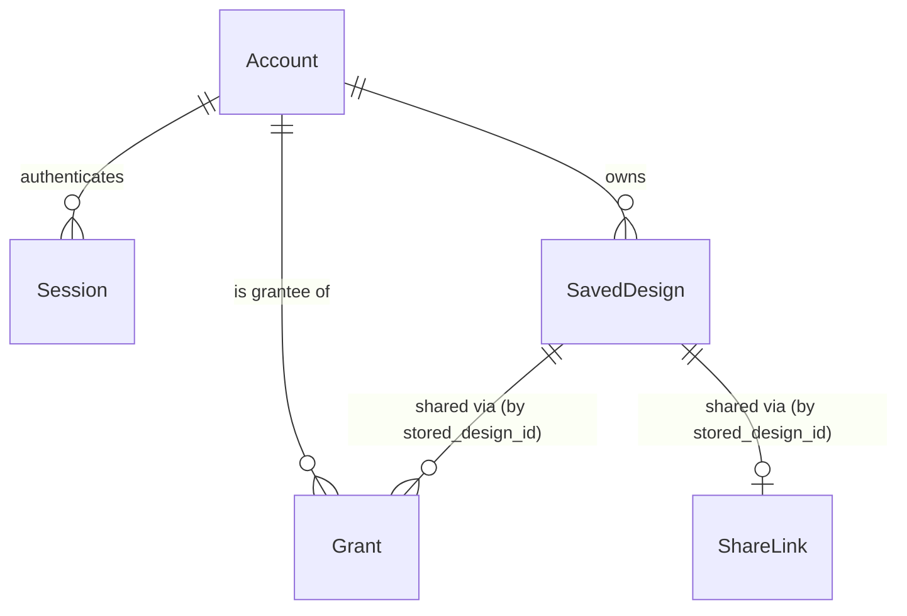

# Functional Specification — `accounts-sharing` (U11)

_Confirmed (consolidated summary confirmed 2026-09-20)._

Upstream inputs: `entities.md`, `rules.md` (this stage), `components.md`,
`contract-summary.md` Contract 4/5.

## Entity-relationship view (derived from `entities.md`)

`SavedDesign`, `Grant`, and `ShareLink` reference U10's `StoredDesign` by
opaque `stored_design_id` value only — that entity lives in a different
Unit's schema and is intentionally not shown as a node here (`entities.md`'s
stated no-cross-crate-FK convention).

## Workflow: sign up and sign in (US9.1)

1. Client sends sign-up (email + credential) or sign-in.
2. On sign-up: an `Account` row is created and a `Session` is issued
   immediately — the caller is signed in without a separate sign-in step
   (BR1.1, AC9.1.1).
3. On sign-in: credentials resolve to an existing `Account`; a `Session` is
   issued. The same `Account` is reached regardless of which device signs
   in (BR1.1, AC9.1.2).
4. Every endpoint in this Unit first checks the access-gate configuration
   flag; if it reads off, the request is refused before any other logic
   runs, regardless of what the client UI does or does not expose (BR2.1,
   AC9.1.3).
5. A gated action attempted while signed out (see BR3.1) responds in a way
   `client-surfaces`/U6 can present as a sign-in invitation — but does not
   itself track "already declined this session," which is client-side
   state (functional-design-questions.md Q2).

## Workflow: migrate a device design on sign-up (US9.2)

1. Sign-up (above) optionally carries a device design payload (Contract 3
   shape, sourced from `local-persistence`/U7).
2. This Unit attaches it to the new `Account` as a `SavedDesign`, copying
   the payload through unchanged — lane order, types, widths, and every
   provenance state identical to the device copy (BR4.1, AC9.2.1, AC9.2.2).
3. If migration fails at any point, no partial `SavedDesign` is committed;
   the device copy is left untouched, and the sign-up response states
   explicitly that the design was not moved (BR4.2, AC9.2.3).

## Workflow: save, name, list, and reopen designs (US9.3)

1. Client (signed in) sends save-with-name naming a design and a
   `stored_design_id` (already uploaded to U10 via its own upload flow, or
   produced by the migration workflow above).
2. If `name` already exists among this account's `SavedDesign` rows, the
   request is refused with a duplicate-name response — the existing row is
   untouched (BR5.2, AC9.3.3).
3. Otherwise a new `SavedDesign` is created; it now appears in the
   account's list under that name (BR5.1, AC9.3.1).
4. Listing an account's designs with zero `SavedDesign` rows returns an
   explicit empty-state indicator rather than a bare empty array (BR5.4,
   AC9.3.4).
5. Reopening a `SavedDesign` returns the referenced design's payload
   unchanged from what was saved (BR5.3, AC9.3.2) — this Unit resolves the
   `stored_design_id` reference and fetches the payload from U10, it does
   not hold a second copy.

## Workflow: private by default and named grants (US10.1, US10.2)

1. A newly created `SavedDesign` has no `Grant` row and no enabled
   `ShareLink` — sharing starts off (BR6.1, AC10.1.1, NFR6.2).
2. Granting named access: the owner names a recipient; this Unit resolves
   the recipient to an existing `Account` (a grant to someone without an
   account is refused — BR7.1) and creates a `Grant` row. Existing
   `ShareLink` state is unaffected either way (BR7.2, AC10.2.1, AC10.2.3).
3. Enabling a link: a `ShareLink` row is created or its `enabled` flag is
   set true and a fresh `token` issued if none exists yet. Existing
   `Grant` rows are unaffected (BR7.2, AC10.2.2, AC10.2.3).
4. Disabling a link: `enabled` is set false immediately; the very next
   request presenting that token is refused (BR7.3, AC10.2.4).
5. A shared-design read (Contract 5) reaches this Unit's own endpoint, not
   U10's identifier-only upload/fetch endpoint (Contract 2). This Unit
   checks the caller's account for a matching `Grant`, or the presented
   token against an enabled `ShareLink`. If authorized, `SharingService`
   reads the payload directly from `DesignRepository` (U10) — an in-process
   call within the single shared Railway service, the exact edge
   `components.md` already declares (`DesignRepository`'s dependents list:
   `SharingService`, "Read and authorise the design being shared") — and
   returns it. If not authorized, this Unit itself responds not-found or
   forbidden and never reads the payload at all (BR8.1, AC10.1.2, AC10.1.3).

## Workflow: sharing state visible in the design list (US10.3)

1. Every design-list response includes, per `SavedDesign`, a computed
   sharing-state value derived from that design's current `Grant` count and
   `ShareLink.enabled` — never a cached value from creation time (BR9.1,
   AC10.3.1, AC10.3.2).
2. The value is a named state (e.g. private / shared-with-N / link-enabled)
   rather than a bare boolean or icon code, so a client can render it as an
   accessible name a screen reader announces (BR9.2, AC10.3.3).

## Assumptions & Open Questions

- **[assumption]** `SavedDesign` (functional-design-questions.md Q1) is a
  new entity introduced at this stage, not present in `components.md`'s
  original catalogue — flagged for the reviewer, since it fills a real gap
  (US9.3's naming requirement has nowhere else to live) rather than
  restating an existing decision.
- **[assumption]** The exact credential mechanism (password vs. magic link
  vs. OAuth) and session token format are deferred to
  `nfr-requirements`/`nfr-design`, consistent with how `design-storage` (U10)
  deferred its own numeric thresholds to that later stage — this stage
  fixes only the behavioural contract (BR1-BR9), not the mechanism.
- **[assumption]** OQ-US5 (`stories.md`, US10.2) — whether a *link reader*
  needs an account — is resolved by `components.md`'s and Contract 5's
  existing statements that a public link requires no account; this was
  already decided upstream of this stage, not reopened here.

## Traceability

See `traceability.json` in this directory.

## Review

**Verdict:** READY
**Reviewer:** aidlc-architecture-reviewer-agent
**Date:** 2026-09-20T07:36:13Z
**Iteration:** 2
**Request Challenge:** review:e2c041c0f9cf6a63087e6b1d79c8ad65

### Findings

| ID | Severity | Location | Finding | Required action | Status |
|---|---|---|---|---|---|
| R-01 | Critical | `rules.md` BR8.1, and this file's "Workflow: private by default and named grants" step 5 | Re-verified against the sibling integration point. `design-storage/functional-design/entities.md`'s Assumptions section still states the full grant/account read check "cannot be built in this Unit alone... is a Stage 2 extension point this Unit's design leaves room for... but does not implement," confirming U10 genuinely has no enforcement of its own to delegate to. BR8.1 is now rewritten so `SharingService` (U11) both decides *and* enforces the authorization itself, reading the payload directly from `DesignRepository` via an in-process call rather than routing through U10's `anonymousDesignId`-only endpoint. This is backed by real evidence, not just prose: `components.md`'s `DesignRepository` entry lists `SharingService` as a dependent with interaction "Read and authorise the design being shared" (line 772-773), `contract-summary.md`'s contracts table names Contract 5 as "U10 / U11" with U11 as owner ("U11 `accounts-sharing` \| Owns link resolution; U10 owns the design it returns"), and `unit-of-work.md` states plainly "Four Units, one deployable" — U9/U10/U11/U12 "shared — the same Railway service" — which makes the claimed in-process call between `SharingService` and `DesignRepository` architecturally real, not a hand-wave. The rewritten workflow step 5 is internally consistent with BR8.1: it clearly shows the request landing at this Unit's own endpoint, this Unit authorizing (Grant or ShareLink check), then this Unit reading from `DesignRepository` directly, and explicitly distinguishes this path from U10's narrower public `/api/designs/{anonymousDesignId}` endpoint. `unit-of-work-dependency.md`'s edge block already declares `accounts-sharing: depends_on: [design-storage]` (line 50), so this is not a new, undeclared cross-unit dependency — the U11→U10 edge the rewrite relies on was already part of the approved topology. `traceability.json` carries no descriptive text of the old (wrong) design; it only maps AC IDs to BR IDs, so there is nothing stale to find there. NFR6.2 and AC10.1.2/AC10.1.3 now have a real, single, correctly-scoped enforcer. Resolved. | None. | Resolved |
| R-02 | Major | `functional-spec.md` ER diagram: `SavedDesign` – `Grant` cardinality | Confirmed fixed. The diagram now reads `SavedDesign \|\|--o{ Grant : "shared via (by stored_design_id)"` (line 14), zero-or-many, matching BR9.1's plural "Grant count" language and the multi-recipient sharing behaviour FR8.2 and US10.2 describe. Resolved. | None. | Resolved |
| R-03 | Minor | `rules.md` BR7.1, BR7.2 `source` fields | Confirmed fixed. BR7.1's `source` field now reads `"components.md SharingService; AC10.2.1; FR8.2"` and BR7.2's now reads `"AC10.2.1; AC10.2.2; AC10.2.3; contract-summary.md Contract 4; FR8.2"` — both cite FR8.2, completing the FR8 group's traceability alongside FR8.1 (BR6.1) and FR8.3 (BR9.1). Resolved. | None. | Resolved |
| R-04 | Major | `rules.md` § Summary table, `BR8` row | New, found while re-verifying R-01's fix. `rules.md`'s "Summary" table (the last section of the file) still reads `\| BR8 \| Authorization decision (enforcement is U10's) \| US10.1 (AC10.1.2/.3) \|`. This directly contradicts the rewritten `BR8.1` immediately above it in the same file, whose heading now reads "Authorization decision AND enforcement (both this Unit's job)" and whose body states this Unit's own `SharingService` performs the enforcement in-process. The table row is a stale leftover from the pre-fix version of the rule and reintroduces, in miniature, the exact false claim R-01 was raised against: a reader who consults only the Summary table (a reasonable thing to do — it is the file's own quick-reference section) would conclude enforcement is still U10's, when the rule it summarizes says the opposite. Not Critical, because the authoritative rule body (`BR8.1`'s `logic` field) and this file's own workflow step 5 are both now correct and would drive a correct implementation if read — but the contradiction inside `rules.md` itself is a real internal-consistency defect a developer skimming only the Summary table would act on incorrectly. | Update the BR8 row in `rules.md`'s Summary table to match the rewritten rule, e.g. `\| BR8 \| Authorization decision and enforcement (both this Unit's) \| US10.1 (AC10.1.2/.3) \|`. | New |

### Validation Tool Results

| Tool | Result | Interpretation |
|---|---|---|
| Cross-check `DesignRepository.dependents` in `components.md` | Confirmed `SharingService`, interaction "Read and authorise the design being shared" (lines 772-773) | Backs R-01's claimed edge; not asserted from prose alone |
| Cross-check Contract 5 ownership in `contract-summary.md` | Confirmed `U10 / U11` provider, `U11` owner, "Owns link resolution; U10 owns the design it returns" (lines 55, 481) | Backs R-01's joint-ownership claim |
| Cross-check U11→U10 edge in `unit-of-work-dependency.md` | Confirmed `accounts-sharing: depends_on: [design-storage]` in the parsed edge block (line 50) and the diagram (line 92) | The in-process call BR8.1 now relies on is not a new, undeclared cross-unit dependency |
| Cross-check deployment topology in `unit-of-work.md` | Confirmed "Four Units, one deployable" — U9/U10/U11/U12 all "shared — the same Railway service" (lines 55-60) | Makes the "in-process call within the single shared Railway service" claim in BR8.1 architecturally real |
| Re-read `design-storage/functional-design/entities.md` Assumptions | Confirmed unchanged: grant/account check still stated as an unbuilt Stage 2 extension point U10 does not implement | Confirms U10 genuinely has nothing to delegate to — the premise R-01's fix depends on still holds |
| Grep `rules.md` for stale "enforcement is U10's" language | Found one surviving instance: the Summary table's BR8 row | New finding R-04 |

### Summary

Both prior findings that were reported fixed are confirmed fixed on independent re-verification, not taken on the developer's account: R-02's ER diagram now correctly reads `||--o{` for `SavedDesign`–`Grant`, and R-03's BR7.1/BR7.2 `source` fields now both cite FR8.2. R-01, the Critical finding, is also genuinely resolved: the rewritten BR8.1 and workflow step 5 are internally consistent, the in-process call they describe is backed by a real `components.md` dependency edge, a real jointly-owned contract, a real declared U11→U10 unit dependency, and a real single-deployable topology fact — not merely restated prose — and the sibling `design-storage/entities.md` file still confirms U10 has no enforcement of its own to delegate to, so the premise for U11 taking ownership is sound. One new Major finding, R-04, surfaced during this re-verification: `rules.md`'s own Summary table still carries the pre-fix "enforcement is U10's" line for BR8, directly contradicting the rewritten rule body a few lines above it in the same file — a real internal-consistency defect, though not one that would mislead an implementer who reads the actual rule rather than only its one-line summary. With zero Critical and one Major finding, this stage clears the READY threshold, but R-04 should be corrected promptly since it is a one-line fix and leaving a stale summary of a just-fixed Critical finding in place invites exactly the confusion R-01 was raised to prevent.
