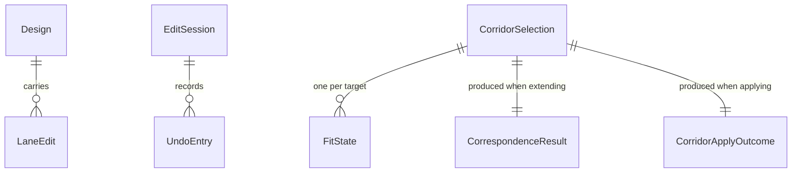

# Functional Specification — `design-editing` (U5)

_Confirmed._

Upstream inputs: `entities.md`, `rules.md` (this stage), `components.md`.

## Entity-relationship view (derived from `entities.md`)

## Workflow: change a lane's type or width (US5.1)

1. `EditingSession` receives a change action against the current
   selection (a street + lane discriminator).
2. Width changes are validated first (BR2.1) — outside `(0, 20]` metres
   is rejected with a stated reason, previous value retained
   (`EditOutcome{applied: false}`).
3. A valid change constructs or updates a `LaneEdit{kind: change}` in
   `DesignOverlay`, setting the changed attribute's provenance to
   UserSet (BR3.1).
4. The updated model is returned synchronously (BR1.1) — no network
   request is issued at any point in this workflow.
5. An `UndoEntry` capturing the prior value is pushed onto the session's
   undo stack.

## Workflow: add or remove a lane (US5.2)

1. **Add**: `DesignOverlay` constructs a `LaneEdit{kind: add}` at the
   chosen position, carrying an anchor (BR4.1) rather than a target lane
   discriminator, with UserSet provenance on every attribute
   (AC5.2.1). It lands in the design layer — landing it in the
   correction layer instead is a distinct, explicitly-chosen action
   owned by `street-import`'s US7.3 (AC7.3.2), not this workflow.
2. **Remove**: `DesignOverlay` constructs a `LaneEdit{kind: remove}`
   against the target lane discriminator; the remaining lanes keep
   their relative order (AC5.2.2).
3. Both push an `UndoEntry`.

## Workflow: see what changed (US5.4)

1. Given a `Design`, enumerate its `LaneEdit`s.
2. If none exist, report "nothing has changed" (BR5.1, AC5.4.2) — never
   an empty three-layer comparison.
3. Otherwise, render the three layers distinguished: the imported
   baseline (`street-core`), the correction layer (`street-import`), and
   this Unit's proposed `LaneEdit`s (AC5.4.1).
4. **Revert** a specific `LaneEdit`: resolve what the attribute held
   immediately before this edit — the corrected baseline value if a
   `Correction` exists for that attribute, otherwise the imported
   baseline value — and restore it along with *that value's own*
   provenance (BR3.1, AC5.4.3). The `Correction`, if any, is untouched by
   this revert; a revert is not a correction removal.

## Workflow: undo (US5.5)

1. `EditingSession` pops the most recent `UndoEntry` from the session's
   undo stack.
2. If the stack is empty, return `EditOutcome{applied: false, findings:
   ["nothing to undo"]}` (AC5.5.3) — never a silent no-op or an error.
3. Otherwise, restore `prior_values` on every street named in
   `affected_streets` as one atomic operation (BR6.1) — a single-street
   edit's undo touches one street; a corridor apply's undo touches every
   street the apply touched, reversed together (AC5.5.2).

## Workflow: extend a design to one adjacent street (US6.1)

1. Given a `Design` on a source street and a chosen adjacent target
   (selected from `CorridorPlanner`'s connected-street set, US6.3),
   compute the `CorrespondenceResult` by matching each `LaneEdit` onto
   the target's lanes by `(lane_type, ordinal_from_kerb)` (BR7.1).
2. Matched edits are applied to the corresponding target lane. Unmatched
   edits leave their target lane untouched and are named in the result
   (AC6.1.3).
3. The target street's own imported baseline and correction layer are
   untouched by this workflow — only a new `LaneEdit` set (this Unit's
   own layer) is added for the target (AC6.1.4).

## Workflow: check fit before applying (US6.2)

1. Before an extension or corridor apply is applied, compute each target
   street's `FitState` (BR8.1): compare the design's total lane width
   against the target's carriageway width (owned by `street-core`).
2. Four possible outcomes, always exactly one: `fits`, `does_not_fit`
   (with the numeric shortfall), `could_not_be_checked` (the target's
   carriageway width is wholly `Inferred` or absent), or
   `not_yet_checked` (evaluation has not run yet — never silently
   omitted from a report, AC6.2.5).
3. A `does_not_fit` warning is shown before anything is applied
   (AC6.2.1). If the user proceeds anyway, the design is applied
   unchanged — never scaled (BR9.1, AC6.2.2) — and the street remains
   marked as not fitting.

## Workflow: choose and apply across a corridor (US6.3, US6.4)

1. `CorridorPlanner` computes the connected-street set from
   `street-core`'s `StreetNetworkGraph` intersection topology, not from
   any coarse display pass (US6.3).
2. The user selects a subset of the connected set as the corridor
   target streets, forming a `CorridorSelection`.
3. Applying: for each target street, run the extend workflow (US6.1) and
   the fit-check workflow (US6.2). Collect results into a
   `CorridorApplyOutcome`: `succeeded`, `warned` (applied despite
   `does_not_fit`), `could_not_be_checked`, and `failed` (could not be
   prepared at all, with a reason) — never atomic (BR10.1, AC6.4.3).
4. On completion, report how many streets received the design, which
   were warned, which could not be checked, and how to undo it
   (AC6.4.2).
5. A single `UndoEntry` with `affected_streets` naming every touched
   street lets undo reverse the whole corridor apply as one unit
   (AC6.4.4, BR6.1).

## Assumptions & Open Questions

- **[assumption]** US5.3 ("do every edit without dragging") and its
  keyboard-path/44px-touch-target acceptance criteria (AC5.3.1-AC5.3.4)
  are assigned to `client-surfaces` (U6) per the story map, not this
  Unit — this Unit's job is to make every action in `EditingSession`'s
  API reachable without requiring drag-specific input (i.e., the API
  itself has no drag-only operation), which is already true by
  construction since every method here is a discrete call, not a
  continuous gesture. The actual keyboard interaction and touch-target
  sizing are U6's rendering concern.

## Traceability

See `traceability.json` in this directory.
