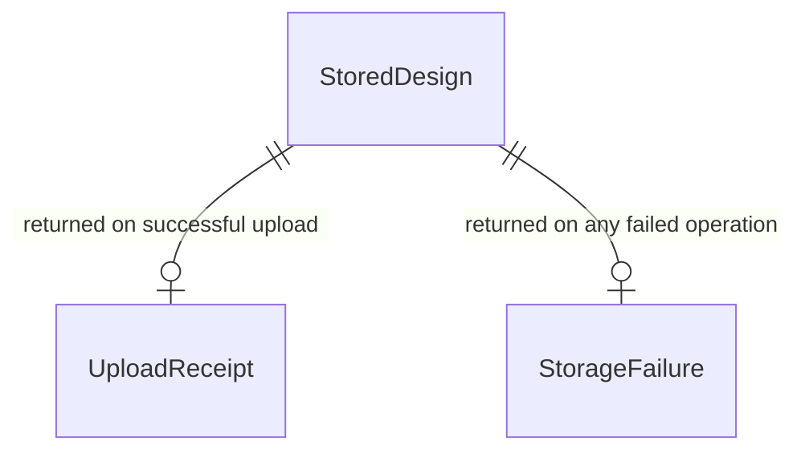

# Functional Specification — `design-storage` (U10)

_Confirmed._

Upstream inputs: `entities.md`, `rules.md` (this stage), `components.md`,
`contract-summary.md` Contract 2.

## Entity-relationship view (derived from `entities.md`)

## Workflow: upload a design (US8.3, AC8.3.1)

1. Client sends `POST /api/designs` with `anonymousDesignId` (client-minted,
   per ADR-006) and the `DesignPayload` (Contract 3).
2. This Unit validates the payload's `payloadVersion` (Contract 3's own
   fail-closed rule) and size; a version mismatch or oversized payload
   returns `unsupported_payload_version` (400) or `payload_too_large`
   (413) respectively (BR6.1) — no partial row is written.
3. On success, a `StoredDesign` row is created with `anonymous_design_id`
   set, `owner_account_id` unset, `created_at` = now, `expires_at` =
   `created_at` + 30 days (BR2.1, BR7.1 — no other identifying data is
   stored).
4. The client receives a `201` with an `UploadReceipt` naming
   `anonymousDesignId`, `uploadedAt`, `expiresAt` — telling the user the
   design now exists off the device (AC8.3.1).
5. A conflicting `anonymousDesignId` (already stored) returns `409`
   (Contract 2) rather than silently overwriting.

## Workflow: fetch a design (Contract 2 `fetchDesign`)

1. Client sends `GET /api/designs/{anonymousDesignId}`.
2. This Unit checks the identifier resolves to a stored row it is
   authorized to return (BR3.1) — in Stage 1, "authorized" means the
   identifier itself resolves to an existing, non-expired row; Stage 2
   extends this to a real grant/account check once `SharingService`/
   `AccountService` (U11) exist.
3. No match, or the design has expired: `404` (`design_not_found`).
   Ungranted once Stage 2 grants exist: `403` (`not_granted`). Neither
   response body ever contains the payload (BR3.1).
4. Rate limiting (BR4.1) applies to this endpoint regardless of outcome —
   repeated attempts against one identifier, or many identifiers from one
   source, receive `429` once a threshold is exceeded.
5. A valid, authorized request returns `200` with the stored
   `DesignPayload` unchanged from what was uploaded.

## Workflow: remove a design (US8.3, AC8.3.4)

1. Client sends `DELETE /api/designs/{anonymousDesignId}`.
2. No account or authentication is checked beyond the identifier itself
   (BR5.1).
3. The row is removed; the response is `204` whether the design existed
   or was already absent/expired (Contract 2) — deletion is idempotent.
4. Rate limiting (BR4.1) still applies, since a delete endpoint keyed on
   a guessable-looking identifier is an equally viable guessing target.

## Workflow: expiry (US11.3)

1. On a schedule (the exact mechanism — a periodic sweep vs. lazy
   expiry-on-read — is a `tech-stack-decisions`/`infrastructure-design`
   choice, not fixed here), every `StoredDesign` row with
   `anonymous_design_id` set and `expires_at` in the past is removed
   (BR2.1, AC11.3.1).
2. An account-owned row (`owner_account_id` set) is never touched by
   this process (AC11.3.2) — retention for those rows ends only via
   account deletion, a `u12-data-rights` operation this Unit does not
   itself trigger.
3. A design that exists only on a device was never received by this
   Unit and is therefore never referenced by this workflow at all
   (AC11.3.3) — there is nothing to "expire" for it.

## Assumptions & Open Questions

- **[assumption]** The exact rate-limiting thresholds (BR4.1) and the
  expiry mechanism's exact trigger (sweep interval vs. lazy check) are
  deferred to `nfr-requirements`/`infrastructure-design`, consistent
  with `osm-extract-proxy`'s (U9) own prior deferral of its timeout/retry
  numeric values to that same later stage.
- **[assumption]** Stage 2's full grant-based authorization (checking a
  named `Grant` or `ShareLink` from `SharingService`) is out of this
  Unit's Stage 1 implementation scope — see `entities.md`'s stated
  assumption.

## Traceability

See `traceability.json` in this directory.
