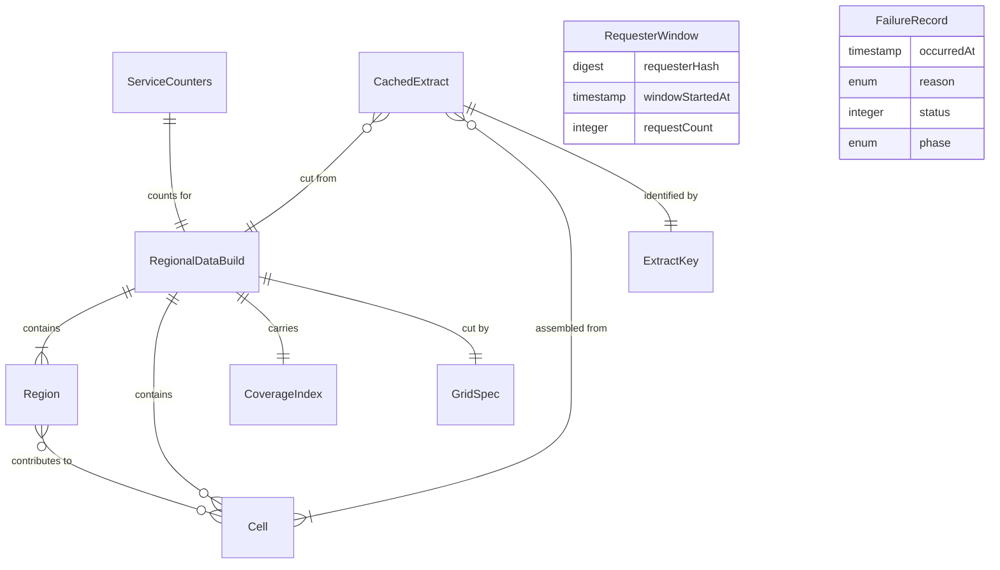

# Functional Specification — `osm-extract-proxy` (U9)

Upstream inputs: `unit-of-work.md` and `unit-of-work-story-map.md`
(units-generation), `requirements.md` (requirements-analysis), `components.md`
and `decisions.md` (domain-design), `contract-summary.md` (contract-design),
`bolt-plan.md` (delivery-planning), `functional-design-questions.md` (this
stage).

This file is the source of truth for this Unit's **workflows and state
machines**. `entities.md` is the source of truth for data shape and `rules.md`
for decision logic; the diagram and rules table near the end are derived
views of those two files.

## What this Unit does, after this stage

`components.md` describes `OsmExtractProxy` as a service that fetches
OpenStreetMap extracts from a public API on a browser's behalf, caches them
keyed on the extract, rate-limits toward that API, and logs nothing that
identifies a requester. Q1 of this stage changed the source: **there is no
live upstream at request time.** The proxy serves clips cut from **regional
data built offline** — Geofabrik sub-region (provincial) extracts, verified,
filtered to what osm2streets reads, sliced into a fixed grid of cells and
shipped with the deploy, rebuilt weekly.

What survives unchanged: the endpoint and response shape of Contract 1, the
no-logging obligation of `decisions.md` ADR-004, the cache keyed on the
extract, and the Unit's boundary — no user data, no design data, no account
data. What is new: a build-time pipeline, a coverage notion (this deployment
carries some regions, not the world), per-requester limiting held in memory,
and a data-build identifier that flows into every extract key.

Two consequences worth stating up front, because they reverse assumptions
earlier artifacts made:

- **Caching does not reduce egress.** A cache hit still sends the extract to
  the browser. The cache buys latency and less cutting work; the egress
  figure B-3 must record is bytes served, cached or not. What does reduce it
  is serving PBF rather than XML (BR5.5).
- **Freshness is the build cadence, not a cache lifetime.** A clip cannot be
  staler than the build it was cut from, and every deploy empties the cache,
  so the only thing that decides how old the map is, is how often the build
  runs (BR8.5).

## Workflows

### W1 — Build the regional data (offline, weekly and on demand)

Runs outside the service — by the maintainer, or on a schedule — and produces
one `RegionalDataBuild`.

1. Read the configured list of publisher sub-regions (for example one
   province) and the `GridSpec`.
2. For each region: download the current extract; download the publisher's
   checksum; verify (BR8.1). A mismatch fails the whole build — nothing is
   published.
3. For each verified region: apply the filter profile (BR8.2), keeping at
   minimum every way with a highway tag and every node those ways reference;
   record the profile name.
4. Slice the kept elements into cells (BR8.3): every way is written into
   every cell its geometry touches, together with all of its nodes. Elements
   inside a cell are written in fixed order (BR5.3 applies at build time
   too).
5. Compute the `CoverageIndex` from the regions' bounds and the grid.
6. Compute each cell's digest, the region digests, and the content-derived
   `buildId` (BR8.4). Write the manifest.
7. Compare `buildId` with the deployed build. If it differs, publish — the
   cells and manifest become part of the next deploy (BR8.5). If it is the
   same, stop; nothing changes.

**Unhappy paths.** A region that cannot be downloaded or fails its checksum
fails the build (step 2). A build that fails publishes nothing; the previous
build keeps serving. A build whose output is identical to the deployed one
does not redeploy.

### W2 — Service start

1. Mint the process-local hash key for requester hashing (BR2.3).
2. Load the manifest. If it is absent or unreadable, enter **Unready**
   (BR9.1).
3. Verify every listed cell is present and matches its digest. Any failure:
   **Unready**.
4. Empty cache, empty requester windows, counters at zero, all bound to the
   loaded `buildId` (BR6.4).
5. Enter **Ready**. From here the service answers extract requests.

While Unready, every extract request is answered `503 upstream_unavailable`
and recorded (BR9.1, BR10.1). The platform's health check — whose shape is
Infrastructure Design's — reads the readiness state so a new version only
takes traffic once Ready (NFR3.2).

### W3 — Serve an extract

Triggered by `GET /api/extract?bbox=…` with `x-client-build`. The phases run
in this order; the first failing phase answers and stops. Every phase runs
inside the request budget (BR10.3).

1. **Build stamp** (BR1.1). Missing or different client build → `426
   ReloadRequired` with the current build.
2. **Requester limit** (BR2.1, BR2.3). Hash the requester's address with the
   process key; find or create its `RequesterWindow`; if the count has
   reached the limit → `429 rate_limited`; otherwise count this request.
3. **Validate** (BR3.1). Unreadable or out-of-range bbox → `400
   invalid_area`.
4. **Canonicalise** (BR3.2). Round to the fixed precision; use only the
   canonical box from here on.
5. **Span** (BR3.3). Compute the set of cells the box touches; more than the
   bound → `400 area_too_large`.
6. **Coverage** (BR4.1). Any touched cell outside the `CoverageIndex` → `404
   area_not_found` ("not an area this deployment covers").
7. **Key** (BR6.1). `ExtractKey` = derived from the canonical box and
   `buildId`.
8. **Cache lookup** (BR6.2). Hit → go to step 12 with the cached bytes;
   count a hit.
9. **Single-flight** (BR6.3). If a cut for this key is in flight, wait for
   it and go to step 12. Otherwise start one; count a miss.
10. **Cut** (BR5.1–BR5.3). Read the touched cells that exist; include every
    way whose extent intersects the box, plus every node those ways
    reference; de-duplicate; order.
11. **Empty check** (BR4.2). No ways → `404 area_not_found` ("nothing mapped
    here"); nothing is cached.
12. **Encode and store** (BR5.4, BR5.5, BR6.2). Encode as PBF (on a miss);
    insert into the cache, evicting least-recently-used entries if the
    ceiling would be exceeded.
13. **Respond.** `200`, `application/octet-stream`, `x-extract-key` set;
    update `ServiceCounters` — extracts served, bytes served,
    `lastExtractBytes` (BR7.4).

**Failure handling across all phases.** Any anticipated failure maps to its
reason and status (BR10.1) and writes one `FailureRecord` carrying reason,
status, phase, time and a project-authored detail (BR7.2) — never the box,
never the address (BR7.1). The request budget elapsing → `503 timeout`
(BR10.3). An unanticipated fault → `503 internal` (BR10.4).

**Business scenarios.**

- *One street, first time.* Marcus selects a street; the client asks for its
  box; steps 1–13 run with a miss; the clip is cut from two or three cells,
  encoded and served; the key is returned. The egress figure for B-3 is
  `lastExtractBytes` after this request.
- *Same street, again.* Same canonical box → same key → hit at step 8; served
  from memory; the requester's window still counts it (BR2.2).
- *Street across a provincial border, other province not configured.* One
  touched cell is uncovered → step 6 answers `404 area_not_found` with the
  "not covered" detail; the client shows US7.1's message and offers US7.2's
  blank cross-section.
- *Runaway client.* The window fills → `429 rate_limited`; the client's
  retry offer applies; nothing about the client is written anywhere.
- *Deploy mid-session.* The tab still holds the old build stamp → `426`;
  the shell surfaces "reload required". After reload, the new build's cache
  is empty and the same street gets a new extract key (BR6.4) — which is
  what lets a correction's fingerprint (US7.5) tell the builds apart.
- *Two users, same street, same second.* The second request attaches to the
  first cut (BR6.3); one cut, two responses, identical bytes (BR5.4).

### W4 — Weekly refresh

The schedule fires W1. If a new `buildId` results, the deploy carries the new
cells and manifest; the service restarts through W2; every existing extract
key is retired with the old build. Nothing in the running service refreshes
itself — freshness is entirely W1's cadence (BR8.5).

### W5 — Reading the egress figure for B-3

`ServiceCounters.lastExtractBytes` after one real street's request, plus
`bytesServed` over a known number of requests, is the figure `bolt-plan.md`
B-3 requires. No request log is consulted, because none exists (BR7.4). How
the counters are exported is `observability-setup`'s; that they exist and
what they may contain is fixed here.

## State machines

### Service readiness

| From | Event | To | Effect |
|---|---|---|---|
| Starting | manifest loaded and every cell verified | Ready | serve extracts |
| Starting | manifest missing, unreadable, or a cell fails its digest | Unready | answer `503 upstream_unavailable` |
| Unready | (no transition) | Unready | a fix is a redeploy |
| Ready | process stops | (gone) | cache, windows and counters discarded |

There is no Ready → Unready transition: the data is read-only and verified
once at start, so a running service cannot lose it.

### Cache entry

| From | Event | To |
|---|---|---|
| (none) | miss on a key with no in-flight cut | Cutting |
| Cutting | cut produced ways and encoded | Cached |
| Cutting | cut produced no ways, or failed | (none) — nothing stored |
| Cached | served | Cached (recency updated) |
| Cached | ceiling exceeded and this entry is least recently used | Evicted |
| Cached | process stops | (gone) |

### Requester window

| From | Event | To |
|---|---|---|
| (none) | first request from a requester hash | Open, count 1 |
| Open | request while count below limit | Open, count +1 |
| Open | request while count at limit | Limited (request answered `429`) |
| Limited | request while window still current | Limited (`429`) |
| Open or Limited | window elapses | (none) — discarded |
| any | process stops | (gone) |

### Regional data build

| From | Event | To |
|---|---|---|
| (none) | schedule fires or maintainer runs W1 | Building |
| Building | a region fails download or checksum | Failed — nothing published |
| Building | every region sliced, manifest written | Built |
| Built | buildId equals the deployed build | Unchanged — no deploy |
| Built | buildId differs | Published — deployed, service restarts |
| Published | a later build is Published | Superseded |

## Failure mapping

| Reason | Status | Retryable | Produced at | Detail says |
|---|---|---|---|---|
| `invalid_area` | 400 | no | W3 step 3 | the area could not be read |
| `area_too_large` | 400 | no | W3 step 5 | the area covers more than one street's worth |
| `area_not_found` | 404 | no | W3 steps 6, 11 | not an area this deployment covers / nothing mapped here |
| `rate_limited` | 429 | yes | W3 step 2 | too many requests; try again shortly |
| `upstream_unavailable` | 503 | yes | any request while Unready | map data is not available right now |
| `timeout` | 503 | yes | any phase, budget elapsed | the request took too long |
| `internal` | 503 | yes | any phase, unanticipated | something went wrong on our side |
| `malformed_extract` | — | — | never (reserved) | — |

## Integration points

| With | What crosses | Where it is fixed |
|---|---|---|
| U4 `street-import` (`ExtractFetcher`) | Contract 1: the request, the bytes, the failure set, `x-extract-key` | `contract-summary.md`, with the amendments below |
| U1 `osm2streets-build` | The golden fixtures are cut by this Unit's W3 from committed cells, so the fixture extract and the served extract are the same bytes | `team.md` Testing Posture |
| `nfr-requirements` (this Unit) | The owed numbers: cell size, cell-span bound, cache byte ceiling, requester window and limit, request budget, canonical precision | BR2.1, BR3.2, BR3.3, BR6.2, BR10.3 |
| `infrastructure-design` (this Unit) | Where cells live in the deploy artifact and its size; the scheduled build job; the health check that reads readiness; how the platform presents the requester's address | W1, W2, BR2.1 |
| `observability-setup` | How `ServiceCounters` and the failure log are exported — never what they may contain | BR7.1–BR7.4 |
| `MapView` (U6) and the tile service | Whether `bbox` stays the request shape once a tile service is chosen — the open question `contract-summary.md` carries, unchanged here | — |

## Amendments required

Recorded rather than edited, because the artifacts are approved and closed —
the treatment `decisions.md` ADR-001 and `contract-summary.md` already use.

| Artifact | What must change | Why |
|---|---|---|
| `contract-summary.md` Contract 1 | Add `invalid_area` to `FailureReason` | The enum has no reason for a bounding box that cannot be read; today a malformed request has no honest answer |
| `contract-summary.md` Contract 1 | Rename `upstream_rate_limited` to `rate_limited` | There is no upstream at request time; the proxy's own per-requester limiter is the only producer, and the old name would tell the user something false |
| `contract-summary.md` Contract 1 | Mark `malformed_extract` reserved | Nothing on the server produces it once extracts are cut from verified cells; kept so the enum stays stable for the adapter's own use |
| `contract-summary.md` Contract 1 | Classify `internal` as retryable | The contract leaves it unclassified; a proxy-side fault is more often momentary than permanent, and the client's retry offer needs an answer |
| `components.md` `OsmExtractProxy` | External dependency "Public OpenStreetMap API" becomes "Geofabrik sub-region extracts, consumed at build time"; the responsibility "politeness toward the upstream public API" becomes "verified, scheduled consumption of the publisher's extracts"; `CachedExtract` loses `expiresAt` and gains `buildId` | Q1, Q1a, Q1b, Q3 of this stage |
| `unit-of-work.md` U9 | "Owns" becomes: building regional data from publisher extracts, serving clips for a bounding box, caching them keyed on the extract, limiting requesters without identifying them, and logging neither addresses nor locations | Same |
| `bolt-plan.md` B-3 | Definition of Done: the weekly build produces a verified, deployed data build; the proxy serves a clip for one real street from it; a second request hits the cache; the egress figure is recorded from the counters | Same; the "rate-limits toward the public OpenStreetMap API" clause no longer describes anything |
| `decisions.md` ADR-004 | Add regional extracts as the alternative taken, superseding the live-query assumption in the Decision paragraph; the no-logging decision and the fallback (browser-direct) stand | The ADR never considered regional files; its privacy decision is unchanged and now carried at the type level (`entities.md`) |
| `unit-of-work.md` Unit index and `unit-of-work-story-map.md` | Carry the dependency graph's unit name (`osm-extract-proxy`) as its own cell beside the `U9` id and the `u9-osm-extract-proxy` directory, for every Unit | The graph names Units without the `u<n>-` prefix while the index and the story map name only the prefixed directory, so the element-level traceability check cannot map any story to any Unit and fails closed for every Unit's functional design — found when this Unit's check ran, and not specific to it |

## Assumptions & Open Questions

- The filter profile of BR8.2 is stated as "what osm2streets reads, at
  minimum highway ways and their nodes". Whether osm2streets also needs other
  classes (crossings, barriers, areas) is proven by the golden fixtures in
  U1, not asserted here. [assumption]
- The publisher's checksum files exist for every sub-region used; if a region
  ships without one, BR8.1 cannot be satisfied for it and the build must fail
  rather than skip verification. [assumption]
- The cells' total size for one province, after filtering to the profile, is
  small enough to ship inside the deploy artifact. If it is not, Infrastructure
  Design moves them to static storage fetched at start — W2 is unchanged
  either way. [assumption]
- The egress figure for one real street is still a measurement (B-3), now of
  a PBF clip; nothing here asserts the ~$5/month budget holds. [assumption]
- Whether `bbox` remains the request shape once a tile service is chosen is
  carried unchanged from `contract-summary.md`. [assumption]
- Which regions the first deployment carries and which streets become the
  golden fixtures are configuration and fixture choices for U1 and code
  generation, not design. [assumption]

## Derived views

### Entity relationships

<!-- Text fallback: A RegionalDataBuild contains one or more Regions and zero or more Cells, carries one CoverageIndex and one GridSpec. A Region contributes to many Cells and a border Cell may be fed by several Regions. A CachedExtract is cut from exactly one build, assembled from one or more Cells, and identified by exactly one ExtractKey. ServiceCounters belong to the loaded build. RequesterWindow and FailureRecord are deliberately unconnected to every other entity: neither can reference a box, a key or a cell, and nothing can reference a requester. -->

### Rules summary

| Group | Rules | What they fix |
|---|---|---|
| BR1 Build stamp | BR1.1 | 426 before anything else |
| BR2 Requester limiting | BR2.1–BR2.3 | Per-requester window on a process-keyed hash; hits count |
| BR3 Validation | BR3.1–BR3.3 | Readable box, canonical form, span bound |
| BR4 Coverage | BR4.1–BR4.2 | Every touched cell covered; empty clip is a stated absence |
| BR5 Clipping | BR5.1–BR5.5 | Touched cells only, complete ways, once each, deterministic, PBF |
| BR6 Caching | BR6.1–BR6.4 | Key from box and build, memory-only LRU, single-flight, empty at start |
| BR7 Privacy and logging | BR7.1–BR7.4 | No address, box or key ever written; aggregate counters only |
| BR8 Regional build | BR8.1–BR8.5 | Verified sources, recorded filter, way-in-every-cell, manifest, weekly |
| BR9 Readiness | BR9.1 | Serve only a verified build |
| BR10 Failures and timing | BR10.1–BR10.4 | One reason and status each; retryable set; budget; no silent fault |

## Review

**Verdict:** READY
**Reviewer:** aidlc-architecture-reviewer-agent
**Date:** 2026-09-12T03:05:10Z
**Iteration:** 1

### Findings

| ID | Severity | Location | Finding | Required action | Status |
|---|---|---|---|---|---|
| R-01 | Minor | `construction/osm-extract-proxy/functional-design/rules.md` > BR5.1 `source`, and `traceability.json` > `reverse` entry for `BR5.1` | BR5.1 ("the clip for a box is assembled only from the cells the box touches") cites `NFR2.2` as its source, but `requirements.md` NFR2.2 reads "Memory use shall remain within a browser tab's practical working set at that scale" — a client-side, browser-tab memory requirement. BR5.1 is a server-side rule bounding the proxy's own read cost per request; nothing in NFR2.2's text is about the server. The citation does not resolve to the claim it is attached to. | Cite the actual source of the constraint (the Q1 follow-up's own stated reasoning about bounding request cost and the $5/month hosting budget, i.e. `functional-design-questions.md` Q1 follow-up and/or NFR5.1) instead of, or in addition to, NFR2.2; or drop the NFR2.2 reference if none of the numbered NFRs actually covers server-side per-request memory. | New |
| R-02 | Minor | `construction/osm-extract-proxy/functional-design/rules.md` > BR3.1 `applies_to` | BR3.1's `applies_to` field reads `"ExtractRequest bbox"`, naming an entity `ExtractRequest` that does not exist anywhere in `entities.md`'s entity catalogue (the entity list is `RegionalDataBuild, Region, GridSpec, CoverageIndex, Cell, BoundingBox, ExtractKey, CachedExtract, RequesterWindow, ServiceCounters, FailureRecord, FailureReason`). The rule's own logic is unambiguous without it, so this is a broken cross-reference rather than a missing behaviour, but it fails the "every entity referenced by a rule exists in `entities.md`" check literally. | Either add `ExtractRequest` to `entities.md` as the (thin) incoming-request shape carrying `bbox` and `x-client-build`, or reword BR3.1's `applies_to` to reference the `bbox` query parameter directly (e.g. `"the bbox query parameter of GET /api/extract"`) so it names no entity that isn't modelled. | New |
| R-03 | Minor | `construction/osm-extract-proxy/functional-design/functional-spec.md` > Assumptions & Open Questions, against `bolt-plan.md` B-0 | B-0 (the gated walking skeleton) lists `u9-osm-extract-proxy` among the seven Units it does *partial* work in, and its Definition of Done requires "a named real street imports through the pinned osm2streets build". Under this stage's redesign, that now requires the full offline pipeline (W1: download a configured region, verify its checksum, filter, slice into cells, publish a manifest) to have run at least once before any extract can be served (BR9.1 refuses to serve until a verified manifest is loaded) — a materially heavier prerequisite for the first, solo, gated Bolt than the live-fetch design it replaces. BR8.5's "or on demand" trigger technically covers a manual first run, and the `## Amendments required` table updates B-3's Definition of Done, but nothing in this spec's `## Assumptions & Open Questions` (which otherwise itemises exactly this class of consequence for B-3, U1 and code generation) says so for B-0, leaving the walking skeleton's own path to a working proxy unstated. | Add a line to `## Assumptions & Open Questions` (or the `## Amendments required` table) stating that B-0 satisfies its "partial work in U9" scope by running W1 on demand for one small configured region before the skeleton's import step, so the walking skeleton's dependency on the offline build is explicit rather than inferred from BR8.5 alone. | New |
| R-04 | Minor | `inception/units-generation/unit-of-work.md` > Unit index, row U9 | The Unit index rates U9 Complexity `S` (Small). This stage adds a build-time pipeline (download, checksum-verify, filter, grid-slice, manifest, scheduled weekly refresh) plus per-requester limiting and a coverage model to what was scoped as a thin fetch-and-cache proxy — a substantively larger unit than an `S` rating implies. The `## Amendments required` table updates U9's "Owns" prose in `unit-of-work.md` but does not flag the Complexity column as something Delivery Planning or Units Generation should revisit. | Add a row (or a note under the existing `unit-of-work.md` row) to `## Amendments required` flagging that U9's Complexity rating warrants re-review given the added build-pipeline scope, so the sizing implication is not silently absorbed. | New |

### Validation Tool Results

| Tool | Result | Interpretation |
|---|---|---|
| `aidlc-sensor-traceability.ts` | FAIL (closed): `"no stories in unit-of-work-story-map.md map to unit \"osm-extract-proxy\""` | Independently verified the cause: `unit-of-work-dependency.md` names units without the `u<n>-` prefix (e.g. `osm-extract-proxy`), so the sensor's alias list for U9 is just that bare string; `unit-of-work-story-map.md`'s Directory column carries only the prefixed, backtick-wrapped form `` `u9-osm-extract-proxy` ``, and the sensor's token-boundary match (`(?:^|[\s,;/])token(?:$|[\s,;/])`) does not treat the hyphen before `osm-extract-proxy` in `u9-osm-extract-proxy` as a boundary, so no cell matches. The failure is real, applies to every Unit, and is correctly recorded as the last row of this artifact's own `## Amendments required` table naming both `unit-of-work.md`'s index and `unit-of-work-story-map.md`. Not treated as blocking this review, per the dispatch brief. |
| `aidlc-sensor-required-sections.ts` (×4 artifacts) | PASS on all four (`entities.md`, `rules.md`, `functional-spec.md`, `traceability.json`) | No template is configured for this stage, so the sensor only reports the H2 structure found; all four files have H2 headings consistent with their stated purpose. |
| `aidlc-sensor-upstream-coverage.ts` | PASS, `unreferenced: []` | All five declared `consumes` (`unit-of-work`, `unit-of-work-story-map`, `requirements`, `components`, `contract-summary`) are referenced in `functional-spec.md`. |
| YAML parse of `entities.md` and `rules.md` fenced blocks (python3 + PyYAML) | PASS | Both blocks parse. `rules.md` has 32 rules, every one carries `id/statement/category/applies_to/trigger/logic/violation/source`, every `category` is one of `validation/authorization/constraint/calculation/policy`, and the 32 ids in the YAML equal the 32 ids in the `## Rules summary` table exactly (no extra, none missing). |
| `traceability.json` internal consistency (manual cross-check against `rules.md` and `unit-of-work-story-map.md`/`stories.md`) | PASS | `upstream_ids` (`AC3.1.1`–`AC3.1.7`) equal exactly the acceptance criteria of US3.1 in `stories.md`, the story `unit-of-work-story-map.md` assigns to U9 via "Also touches". Every `coverage[].target` BR id (`BR5.2, BR5.3, BR5.4, BR10.3`) exists in `rules.md`. The 28 ids in `reverse` plus the 4 ids referenced from `coverage` account for all 32 rule ids in `rules.md` with no omission and no duplicate. The `N/A` reasoning for `AC3.1.2`, `AC3.1.3` and `AC3.1.7` checks out against `unit-of-work-story-map.md`'s "Falsifiable from"/ownership notes and `decisions.md` ADR-001's divergence table (items 6 and 7) respectively. |
| Mermaid `erDiagram` in `functional-spec.md` (manual inspection, no renderer available) | PASS | Balanced braces, valid crow's-foot tokens (`||--|{`, `||--o{`, `||--||`, `}o--o{`, `}o--|{`) throughout, attribute blocks (`RequesterWindow`, `FailureRecord`) use valid `type name` pairs matching their `entities.md` attributes (minus the optional `detail` field on `FailureRecord`, immaterial). Cardinalities annotated on each edge match the prose cardinality stated in the corresponding `entities.md` relationship where one is stated. |
| Contract 1 amendment claims vs. `contract-design/contract-summary.md` (manual read) | PASS | Confirmed against the actual OpenAPI block: the `FailureReason` enum currently has no `invalid_area` member (amendment 1 is real), currently has `upstream_rate_limited` not `rate_limited` (amendment 2 is real and the renamed literal is already used elsewhere in the same file for a sibling contract, so it aligns with existing convention), `malformed_extract` is already a valid enum member so "mark reserved" needs no enum edit (accurate), and the "Retryable classes" prose lists only `upstream_unavailable`, `upstream_rate_limited` and `timeout` — `internal` is indeed unclassified today (amendment 4 is real). `area_too_large` needed no enum addition, correctly not claimed as one. |
| Privacy obligation (`decisions.md` ADR-004) vs. every entity/rule (manual trace) | PASS | Only `RequesterWindow` (a keyed hash, a window start, a count) is requester-derived state, and it carries no field able to hold a `BoundingBox`, `ExtractKey` or location; only `CachedExtract`/`Cell`/`ExtractKey` hold location/extract data and none of them carry a requester field. `FailureRecord` is restricted by both its own `entity_constraints` and BR7.1/BR7.2 to reason/status/phase/time/detail. This is the same reading Q4 of this stage's own question file gave the human, and the human accepted it (Q4 = A). |
| Technology-agnosticism (grep for SQL/framework/language tokens across all four artifacts) | PASS | No hits for Rust, SQL, specific datastore, or web-framework identifiers; the design stays at the design level throughout. |

### Summary

The four artifacts are internally consistent and hold up under an adversarial pass: every rule id round-trips between the YAML, the summary table and `traceability.json`; the traceability sensor's failure is exactly what the artifact already diagnoses and amends, not an undisclosed problem; the Contract 1 amendment claims check out line-for-line against the actual OpenAPI block; and the ADR-004 privacy obligation is carried at the type level with no entity able to pair a requester with a location. The Q1/Q1a/Q1b pivot from a live Overpass query to offline-built Geofabrik regional clips is threaded consistently through the entities, rules, workflows, state machines and failure mapping, with its consequences for `components.md`, `unit-of-work.md`, `bolt-plan.md` B-3 and `decisions.md` ADR-004 correctly recorded as amendments rather than silently absorbed. The four findings above are real but narrow: a misattributed NFR citation, one rule naming an entity that was never modelled, and two documentation gaps (the walking skeleton's implicit dependency on an on-demand build run, and an unflagged Complexity re-rating) — none of which blocks a developer from implementing this Unit as specified.
