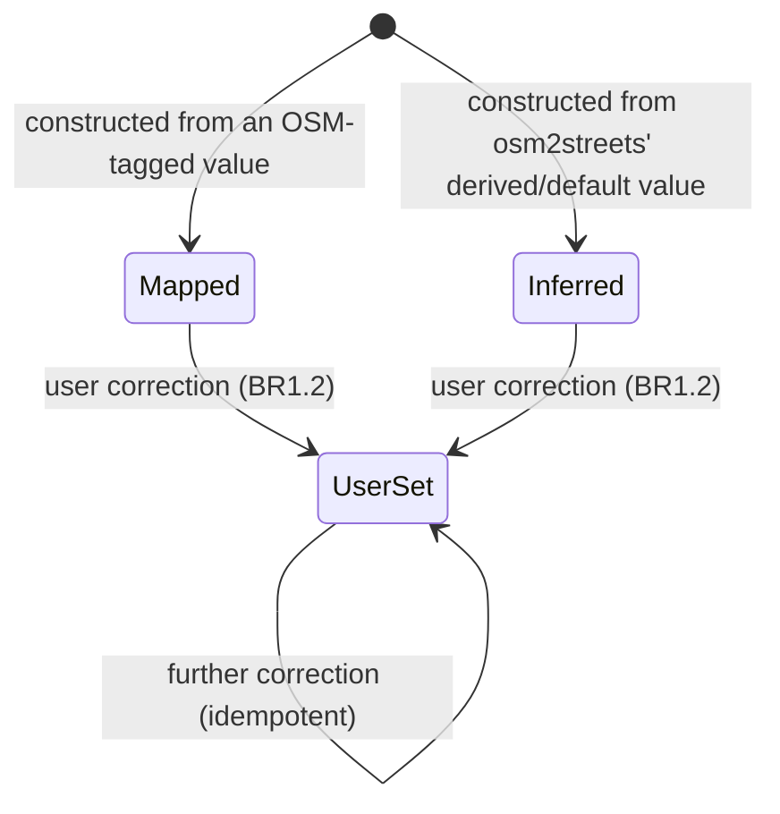
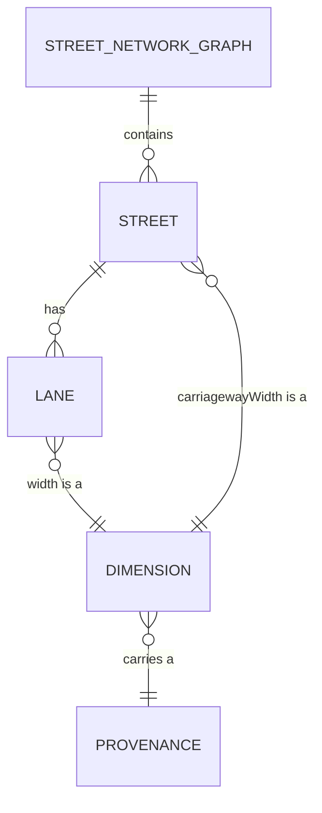

# Functional Specification — `street-core` (U2)

_Confirmed._

Upstream inputs: `entities.md`, `rules.md` (this stage), `components.md`
StreetModel (domain-design), `requirements.md` FR3.1-FR3.4.

This file is the source of truth for this Unit's **workflows and state
transitions**. `entities.md` is the source of truth for data shape and
`rules.md` for decision logic; the diagram and rules summary below are
derived views of those two files.

## What this Unit does

`StreetModel` is the imported baseline: it holds the street and lane types
exactly as an import produced them, and nothing that changes them. This
Unit does not fetch data, run osm2streets, or render anything — it owns
the port through which an import happens (`StreetSource`) and the types
that result from one.

## Workflow: constructing the baseline from an import

This Unit does not perform the import (that is `u4-street-import`'s
`StreetImportAdapter`, which implements the `StreetSource` port this Unit
declares). What this Unit specifies is the shape of that handoff and the
invariants the result must satisfy before it is considered a valid
`StreetModel`.

1. A caller (ultimately `AppShell`, through `CompositionRoot`'s concrete
   `StreetSource`) requests an import for an area.
2. The `StreetSource` implementor returns a `StreetNetworkGraph` populated
   with `Street`s and their `Lane`s — already converted into this Unit's
   own types (BR1.1: every `Dimension` already carries a `Provenance`; no
   intermediate "unmarked" state ever exists, even transiently, within
   this Unit's types).
3. Each `Street`'s identity (BR3.1) and each `Lane`'s key (BR2.1) are
   fixed at construction and never recomputed afterward.
4. Each `Street`'s `carriagewayWidth` (BR4.1) is computed once at
   construction from its lane list.
5. The constructed `StreetNetworkGraph` is handed to the caller behind a
   shared reference only (BR5.1) — from this point on, nothing in this
   Unit's own API can mutate it.

No step in this workflow can fail *within this Unit* — a failure during
the actual import (network, parsing, a malformed osm2streets response) is
entirely `u4-street-import`'s concern, surfaced through the `StreetSource`
port's own `Result` type, which this Unit declares but does not implement.

## State machine: Provenance

A single `Dimension`'s `Provenance` has three states and one legal
transition:

`Mapped` and `Inferred` are only ever entered at construction time (by
whatever calls through `StreetSource` — this Unit does not itself decide
which of the two applies; that decision is the adapter's, from
osm2streets' own `LaneSpec.lane: Option<Lane>` distinction, per
`stories.md` US4.1's implementation note). Once a value is corrected, it
is `UserSet` permanently — there is no transition back to `Mapped`, and a
second correction stays in `UserSet` (BR1.2).

## Entity relationships (derived from `entities.md`)

## Rules summary (derived from `rules.md`)

| Rule | Statement (short) |
|---|---|
| BR1.1 | Every Dimension has a Provenance; no unmarked state |
| BR1.2 | Correction → UserSet, permanently |
| BR2.1 | Lane key is derived, never positional |
| BR2.2 | Lane access never panics |
| BR3.1 | Street identity is way id + bounding node-id pair |
| BR4.1 | One carriageway-width definition, computed once |
| BR5.1 | Baseline is immutable after construction |
| BR6.1 | Metres only |
| BR7.1 | This Unit declares StreetSource; implements nothing of it |

## Assumptions & Open Questions

None.

## Traceability

See `traceability.json` in this directory.
