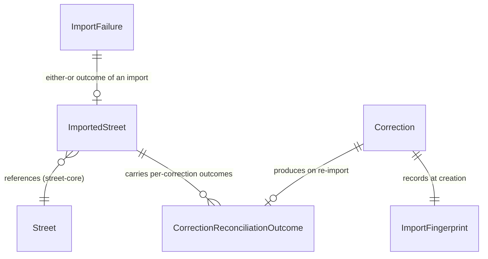

# Functional Specification — `street-import` (U4)

_Confirmed._

Upstream inputs: `entities.md`, `rules.md` (this stage), `components.md`,
`contract-summary.md` Contract 1 and Contract 8.

## Entity-relationship view (derived from `entities.md`)

## Workflow: import a street (US3.1)

1. The caller (`CompositionRoot`, via the core's `StreetSource` port —
   Contract 8) triggers an import for a selected street or area.
2. `ExtractFetcher` issues one request per area to `OsmExtractProxy`
   (Contract 1's `GET /api/extract`), applying the timeout budget (BR1.1).
3. **Success path**: extract bytes return. `StreetImportAdapter` runs the
   pinned osm2streets crate over them and converts its native structs into
   `Street`/`Lane`/`StreetNetworkGraph` (owned by `street-core`), assigning
   Mapped/Inferred provenance to every Dimension at construction (BR4.1).
   The lanes are ordered left to right, each carrying a type, a direction
   and a width (AC3.1.1).
4. **Failure path**: the fetch times out, the upstream returns an error, or
   osm2streets cannot process the extract. `ExtractFetcher` or
   `StreetImportAdapter` (whichever detected it) constructs an
   `ImportFailure` naming the street and one closed `FailureReason` (BR3.1),
   and classifies it retryable or not (BR2.1). Control passes to the
   "handle an import failure" workflow below.
5. On success, `CorrectionOverlay` reconciles every stored `Correction`
   whose `target_street` matches the imported street against the fresh
   `ImportFingerprint` — see "Workflow: re-import reconciliation" below —
   and the resulting `ImportedStreet` (baseline plus reconciliation
   outcomes) is returned through the `StreetSource` port.

While the import runs, the cross-section panel opens immediately with the
street's name and a skeleton cross-section (AC3.1.3) — that immediate-open
behaviour is `CrossSectionView`'s (U6), triggered by the same selection
event this workflow starts from; this Unit does not render it.

## Workflow: handle an import failure (US7.1, US7.2)

1. The `ImportFailure` from the import workflow is surfaced with the
   street's selection-time name and no library text (BR3.1, AC7.1.1,
   AC7.1.2).
2. Retry is offered as the first action whenever `failure.retryable` is
   true; starting from a blank cross-section is offered alongside it
   always, regardless of retryability (AC7.2.1) — retry is never the only
   option, since some failures cannot be retried into success.
3. If retry is chosen and succeeds, the caller receives the imported
   cross-section from the workflow above, not the blank one (AC7.2.2).
4. If the blank cross-section is chosen, this Unit's obligation ends at
   handing back "no import occurred" — `design-editing` (U5) constructs
   the blank editing state, and every attribute set on it carries UserSet
   provenance from the moment it is set (BR9.1, AC7.2.3, AC7.2.4).
5. The underlying error (the osm2streets panic or network error this
   Unit mapped into the typed reason) is logged once, locally to this
   Unit, with the source street identifier (US7.4's local half). The
   maintainer-facing aggregation of repeated failures across streets is
   deliberately not this Unit's concern — it is realised at
   `observability-setup` (see `traceability.json`'s `Deferred` entries).

## Workflow: correct what the import got wrong (US7.3)

1. Given an imported cross-section with a value the user knows to be
   wrong, the user corrects it.
2. `CorrectionOverlay` constructs a `Correction` keyed by
   (`osm_way_id`, `bounding_node_ids`, `target_lane_discriminator`)
   (BR6.1), carrying the corrected `attribute`/`value` and a freshly
   captured `ImportFingerprint` (way tags, complete `MapConfig`, pinned
   osm2streets revision) (BR5.1 for the permanence guarantee this
   creates).
3. A correction that adds a lane the import missed (the committed
   cycleway fixture case, AC7.3.2) becomes part of the correction layer,
   never the design layer. A correction that removes a lane the import
   invented (AC7.3.3) removes it from the corrected baseline the same way
   — the `target_lane_discriminator` is absent on this kind, since there
   is no lane left to key by once removed.
4. No write is ever issued to any OpenStreetMap endpoint by this or any
   other operation this Unit performs (BR7.1, AC7.3.5).

## Workflow: re-import reconciliation (US7.5)

For every stored `Correction` whose `target_street` matches a
freshly-imported street:

1. Compare the `Correction`'s stored `ImportFingerprint` against the
   fresh import's fingerprint.
2. **Fingerprints match** — outcome = `reapplied_silently`. The
   correction's effect is applied to the fresh baseline with no user
   notice (AC7.5.2).
3. **Fingerprints differ, but the lane still resolves** by
   `target_lane_discriminator` against the fresh baseline — outcome =
   `reapplied_with_notice`. The correction's effect is applied, and the
   user is told the underlying import changed (AC7.5.3).
4. **The lane no longer resolves** — outcome = `unresolved`. The
   correction is retained, neither applied nor discarded, and remains
   visible so the user can see what it was (AC7.5.4). `state` on the
   `Correction` itself is set to `unresolved`.

These three outcomes are exhaustive (BR8.1) — there is no fourth path and
no silent drop of a correction that no longer resolves.

## Assumptions & Open Questions

- **[assumption]** The exact timeout budget value (BR1.1, AC3.1.6) and the
  conversion-time threshold (AC3.1.2) are deferred to `nfr-requirements`,
  per those ACs' own stated deferral discipline — this stage fixes the
  required behaviour (fail rather than wait indefinitely; report but don't
  gate the measured time) without inventing a number nobody has measured
  yet.

## Traceability

See `traceability.json` in this directory.
