# Component Catalogue — Streetmix at City Scale

Upstream inputs: `requirements.md` (requirements-analysis), `stories.md`
(user-stories), `mockups.md`, `interaction-spec.md` and
`accessibility-checklist.md` (refined-mockups), `team-practices.md`
(practices-discovery), `domain-design-questions.md` (this stage).

A component here is **code this project writes** — a bounded piece of software
with its own logic, entities and lifecycle. Databases, caches, the basemap
service and the OpenStreetMap API are `external_dependencies` of components,
never components. Deployment topology is Units Generation's decision, not this
stage's.

Architecture decisions and their alternatives are in `decisions.md`. This file
is the catalogue and the rationale for each boundary.

**How this catalogue is checked.** The `dependents` lists are derived from the
`depends_on` lists rather than written alongside them, so symmetry holds by
construction. The result is then validated by parsing this file's own YAML block
and re-checking every rule against the parsed structure: unique names, no
self-dependency, symmetric edges, one owner per entity, every reference
resolving, an acyclic graph — **and the direction of every edge against the
crate layers `team.md` mandates.** That last check exists because it was missing
from the first draft, which was acyclic at the component level and still
described a dependency cycle between the adapter crate and the core crate.
Cargo would have refused to build it. See `decisions.md` ADR-008.

## What this stage settled

| Question | Settled as | Closes |
|---|---|---|
| Editing surface | Real page elements for the lane strip and its controls; canvas only for the map | `requirements.md` OQ2, `stories.md` OQ-US7 |
| OpenStreetMap source | Fetched through a Railway-hosted proxy, with its real egress measured at B-0 | `requirements.md` OQ1 (partially — the cost is deferred, not the path) |
| Corridor correspondence | Lane type plus ordinal from the kerb | `stories.md` OQ-US6 |
| Anonymous upload identity | A 128-bit browser-minted random identifier, no edit token | AC8.3.5 |
| Viewing a shared design | Public link needs no account; a named grant requires one | `stories.md` OQ-US5 |
| Layer storage | Two separate overlays — corrections carry the import fingerprint, design edits do not | — |
| Triggering an import | A `StreetSource` port owned by the core, implemented by the adapter, wired by the entry crate — so no component with testable behaviour names the adapter | Architecture review R-05 |

**The editing-surface answer is the one that unblocks the walking skeleton.**
Because each lane is a real focusable, announceable element, B-0's third pass
criterion — mapped values visibly distinguished from inferred ones in what is
rendered — is testable from the first Bolt rather than falling to a manual
screen-reader walkthrough on every release forever. Every canvas-conditional
row in `accessibility-checklist.md` resolves to its DOM branch.

## Three stories this design covers that no requirement does

`stories.md` records five amendments required of `requirements.md` and
`scope-document.md` "before Domain Design". None landed, and this stage
proceeded on the human's decision at Q1, covering the orphans here so the design
is complete even though the requirements are not. Two more amendments were added
by this stage's own decisions. All seven are recorded in `decisions.md` ADR-001.

| Story | Requirement | Covered here by |
|---|---|---|
| US5.5 — undo | None. `requirements.md` does not mention undo | `EditingSession` |
| US8.2 — work gone from this device | None. FR7.2 covers surviving sign-in, not storage loss | `LocalDesignStore` |
| US8.3 — keep a design off this device | None. FR7.2 and FR9.3 both assume the account path | `UploadClient` |

## Component boundary options

Two decompositions are viable. The catalogue below is Option A.

**Option A — separate the three layers and the two Stage 2 identity concerns
(19 components).** `CorrectionOverlay` and `DesignOverlay` are distinct
components; `AccountService`, `SharingService` and `DataRightsService` are
distinct. `CompositionRoot` is counted here but is not a boundary choice — it
is the entry point every build needs, named as a component because R-05 made
its role load-bearing.

- Pros: the correction layer carries an import fingerprint and three re-import
  outcomes that a design edit has no use for, so keeping them apart means a
  mislabelled entry cannot silently convert a proposal into a claim about the
  street — the failure class the whole provenance model exists to prevent.
  `DataRightsService` is a release gate rather than a feature, and giving it its
  own boundary makes it visible as one.
- Cons: more components to hold in mind, and three of them are thin.
- Reversibility: high. Merging two overlays later is a local change; splitting a
  merged one after it has stored data is not.

**Option B — one overlay with a layer tag, and one Stage 2 identity component
(14 components).**

- Pros: fewer boundaries, one key scheme, less serialisation code.
- Cons: the fingerprint logic filters by tag rather than by type, so the
  distinction between "the import was wrong" and "I propose a change" rests on a
  field rather than on the type system — against `team.md`'s own principle that
  the un-annotated form should be unconstructable.
- Reversibility: low in the direction that matters. Once designs are stored under
  one schema, separating them requires a migration.

**Recommendation: Option A**, because the two overlays differ in what they claim
rather than in what they store, and because the reversibility is asymmetric —
merging later is cheap, splitting later is not.

## Part A — Catalogue

```yaml
components:
  - name: ExtractFetcher
    summary: "Requests OpenStreetMap extracts for a place and classifies what comes back."
    behaviour: >
      Issues one request per requested area to OsmExtractProxy.
      Applies a timeout and treats exceeding it as a failure rather
      than waiting indefinitely (AC3.1.6). Classifies every outcome
      into the project's closed set of typed failure reasons so
      US7.1 can name one without leaking library text (AC7.1.1,
      AC7.1.2). Retries only on transient classes, never on
      malformed data, because retrying a badly tagged street returns
      the same bytes (AC7.2.1, AC7.2.2). Holds no OSM knowledge
      beyond fetching: it never parses lanes.
    responsibilities:
      - "Fetching extract bytes for a requested area"
      - "Timeout and retry policy for those fetches"
      - "Classifying failures into the typed reason set"
    depends_on:
      - component: OsmExtractProxy
        interaction: "Fetch extract bytes for an area"
        style: sync
    dependents:
      - component: StreetImportAdapter
        interaction: "Obtain the extract bytes to convert"
    entities: []

  - name: StreetImportAdapter
    summary: "The only component permitted to depend on osm2streets; converts its output into project-owned provenance-carrying types."
    behaviour: >
      A parse-and-validate boundary. Runs the pinned osm2streets
      crate over extract bytes and converts native structs into the
      project's own types, never re-exporting an osm2streets type
      past itself (team.md Code Style). Reads LaneSpec's tagged-
      versus-defaulted width signal to assign Mapped or Inferred
      provenance at the type level, so an un-annotated dimension is
      unconstructable downstream (FR3.1). Maps every osm2streets
      error and any panic it cannot avoid triggering into the
      project's typed failure enum, logging the underlying error
      once with the source street identifier and never rendering it
      to a user. That log is **local to this component** — it exists
      so a failure is not silent in the browser that hit it. It is
      not maintainer-facing visibility: aggregating repeated failures
      on the same street so a maintainer can see the pattern is
      US7.4's other half, realised at `observability-setup` and
      deliberately not here (see `traceability.json`). Produces both
      the per-street cross-section and the street network graph the
      corridor work needs. Implements the core's `StreetSource` port
      rather than being called directly by the outer ring, so the only
      component that names this one concretely is `CompositionRoot`.
    responsibilities:
      - "Running the pinned osm2streets crate"
      - "Assigning mapped-versus-inferred provenance at the boundary"
      - "Producing the street network graph used for connectivity"
      - "Translating dependency errors into the project's typed reasons"
      - "Implementing the core's StreetSource port"
    depends_on:
      - component: ExtractFetcher
        interaction: "Obtain the extract bytes to convert"
        style: sync
      - component: StreetModel
        interaction: "Construct the domain types it returns"
        style: sync
    dependents:
      - component: CompositionRoot
        interaction: "Construct the concrete import path and supply it as the core's StreetSource"
    external_dependencies:
      - name: "osm2streets crate"
        kind: other
        purpose: "Pinned to a commit SHA with its abstutil dependency pinned the same way; the source of lane geometry and network topology"
    entities: []

  - name: StreetModel
    summary: "The imported baseline: a street, its ordered lanes, the network they form, and every dimension's provenance. Immutable once constructed."
    behaviour: >
      Holds the street exactly as imported, behind shared references
      only — never mutable ones — so no edit can reach it (team.md
      Code Style). Every physical quantity is a Dimension carrying
      one of Mapped, Inferred or UserSet; the un-annotated form does
      not exist (FR3.1). Metres are the only unit; conversion
      happens at the presentation boundary and never here (TC-5).
      Lane access is bounds-checked, returning an Option rather than
      panicking. A lane's key is **derived**, not generated: lane
      type, direction and ordinal from the kerb, so the same lane in
      two independent imports of the same street resolves to the
      same key and a correction survives a re-import (AC7.3.4). The
      full overlay key is that lane key together with the street's
      OSM way id and its direction-normalised bounding node-id pair.
      A lane the user added exists in no import and therefore has no
      derivable key; it carries a project-minted identifier and an
      anchor instead, and those live in DesignOverlay rather than
      here. Owns the project-wide definition of carriageway width —
      the sum of lane widths between the two kerb buffers where both
      exist, otherwise the sum excluding walkable lane types and
      verge buffers — because osm2streets returns no kerb-to-kerb
      width and two definitions of the kerb in one product is a bug
      waiting for a thin street. Also owns the `StreetSource` port —
      the shape of "import a street", declared here and implemented
      by StreetImportAdapter — so the outer ring can trigger an
      import without naming the adapter crate, and so everything
      above import can be tested against a fake source with
      osm2streets not compiled in at all.
    responsibilities:
      - "The imported street and lane types"
      - "The street network graph, as a core type rather than an adapter type"
      - "The provenance type and its legal transitions"
      - "The derived lane key, and the street key it composes with"
      - "The project-owned carriageway-width definition"
      - "Bounds-checked lane access"
      - "The StreetSource port the adapter implements and the outer ring calls through"
    depends_on: []
    dependents:
      - component: StreetImportAdapter
        interaction: "Construct the domain types it returns, and implement the StreetSource port"
      - component: AppShell
        interaction: "Trigger an import through the StreetSource port"
      - component: CompositionRoot
        interaction: "Supply the concrete StreetSource the rest of the app calls through"
      - component: CorrectionOverlay
        interaction: "Attach corrections to baseline lanes by key"
      - component: DesignOverlay
        interaction: "Express edits against baseline lanes"
      - component: EditingSession
        interaction: "Read the baseline being edited"
      - component: CorridorPlanner
        interaction: "Read the network graph for connectivity, and compare widths using the owned carriageway definition"
      - component: MapView
        interaction: "Read the network graph for display"
      - component: CrossSectionView
        interaction: "Read the baseline being displayed"
      - component: ExportComposer
        interaction: "Read the baseline being depicted"
    entities:
      - name: Street
        identifier: "osmWayId plus the direction-normalised bounding node-id pair"
        attributes: [osmWayId, boundingNodeIds, name, lanes, carriagewayWidth]
      - name: Lane
        identifier: "laneKey, derived from laneType, direction and ordinalFromKerb"
        attributes: [laneKey, laneType, direction, width, ordinalFromKerb]
        references:
          - entity: Street
            owned_by: StreetModel
            relationship: "each Lane belongs to exactly one Street"
      - name: StreetNetworkGraph
        identifier: "graphId"
        attributes: [graphId, streets, intersections, adjacency]
        references:
          - entity: Street
            owned_by: StreetModel
            relationship: "the graph's nodes are Streets from this same component"

  - name: CorrectionOverlay
    summary: "Corrections a user made to imported data that was wrong, and what happens to them when the street is imported again."
    behaviour: >
      A correction states that the import itself was wrong, so it is
      permanent and its provenance is UserSet and never returns to
      Mapped (FR3.4, AC7.3.1). Distinct from a design edit, which
      proposes a change to a street the import described correctly.
      Records a fingerprint of what was imported — the way tags, the
      complete MapConfig and the pinned osm2streets revision — at
      the moment the correction is made (AC7.5.1). On re-import it
      produces exactly one of three outcomes: fingerprint matches,
      so re-apply silently; fingerprint changed but the corrected
      lane still resolves by its key, so re-apply and say the import
      changed; the lane no longer resolves, so retain the correction
      as unresolved and neither apply nor discard it
      (AC7.5.2-AC7.5.4). Never writes to OpenStreetMap (FR2.3).
    responsibilities:
      - "Correction entries and their permanence"
      - "The import fingerprint and its comparison"
      - "The three re-import outcomes, including the unresolved state"
    depends_on:
      - component: StreetModel
        interaction: "Attach corrections to baseline lanes by key"
        style: sync
    dependents:
      - component: DesignOverlay
        interaction: "Resolve what a revert returns to"
      - component: EditingSession
        interaction: "Record corrections"
      - component: LocalDesignStore
        interaction: "Serialise and restore corrections"
      - component: MapView
        interaction: "Mark streets with unresolved corrections"
      - component: CrossSectionView
        interaction: "Show corrections and the unresolved banner"
      - component: ExportComposer
        interaction: "Read corrections so the depiction is the corrected one"
    entities:
      - name: Correction
        identifier: "correctionId"
        attributes: [correctionId, targetStreet, targetLaneDiscriminator, attribute, value, importFingerprint, state]
        references:
          - entity: Lane
            owned_by: StreetModel
            relationship: "each Correction targets one imported Lane, or none once unresolved"

  - name: DesignOverlay
    summary: "The proposed change: what the user wants this street to become, held separately from what it is."
    behaviour: >
      Carries lane edits, added lanes and removals as a proposal
      over the baseline plus its corrections. Makes no claim about
      reality, which is why it carries no import fingerprint — a
      proposal cannot go stale against OpenStreetMap the way a
      correction can. An added lane exists in no import, so it is
      stored against an anchor relative to a keyed baseline lane
      rather than a position index, and returns to that anchor on
      reload (AC5.2.3, AC5.2.4). Reverting an edit returns the value
      it held before that edit — the corrected baseline where a
      correction exists, otherwise the imported baseline — carrying
      that value's own provenance, so a reverted mapped width reads
      Mapped again (AC5.4.3). Rejects a width of zero, a negative
      width, or one above 20 metres, returning the reason and
      retaining the previous value (AC5.1.5).
    responsibilities:
      - "Lane edits, additions and removals as a proposal"
      - "Anchors for lanes that exist in no import"
      - "Revert semantics across the three layers"
      - "Width range validation"
    depends_on:
      - component: StreetModel
        interaction: "Express edits against baseline lanes"
        style: sync
      - component: CorrectionOverlay
        interaction: "Resolve what a revert returns to"
        style: sync
    dependents:
      - component: EditingSession
        interaction: "Record design edits"
      - component: CorridorPlanner
        interaction: "Write the applied design onto each target"
      - component: LocalDesignStore
        interaction: "Serialise and restore designs"
      - component: MapView
        interaction: "Highlight the current design's streets"
      - component: CrossSectionView
        interaction: "Show proposed changes"
      - component: ExportComposer
        interaction: "Read the proposed design"
    entities:
      - name: Design
        identifier: "designId"
        attributes: [designId, name, streets, createdAt, updatedAt]
      - name: LaneEdit
        identifier: "editId"
        attributes: [editId, design, targetStreet, targetLaneDiscriminator, anchor, attribute, value, kind]
        references:
          - entity: Design
            owned_by: DesignOverlay
            relationship: "each LaneEdit belongs to one Design"
          - entity: Lane
            owned_by: StreetModel
            relationship: "an edit targets one baseline Lane, except an addition, which carries an anchor instead"

  - name: EditingSession
    summary: "The editing state machine: what is selected, what changed, and what undo reverses."
    behaviour: >
      Holds the current selection and applies every action on the
      committed editing-action list. Returns the updated model
      within the same synchronous call and issues no network
      request, which is the property that protects the interaction
      budget (AC5.1.2). Every action is reachable by selection and
      command alone; a drag, where offered, duplicates one (FR4.3,
      FR4.4). Undo reverses the most recent action, and reverses a
      corridor apply across every street it touched as a single unit
      (AC5.5.1, AC5.5.2). With nothing to undo it changes nothing
      and says so rather than failing silently (AC5.5.3). Editing
      operations return an outcome plus findings rather than
      throwing.
    responsibilities:
      - "Selection state"
      - "Applying every action on the committed editing-action list"
      - "The undo history, including multi-street entries"
    depends_on:
      - component: StreetModel
        interaction: "Read the baseline being edited"
        style: sync
      - component: DesignOverlay
        interaction: "Record design edits"
        style: sync
      - component: CorrectionOverlay
        interaction: "Record corrections"
        style: sync
    dependents:
      - component: CrossSectionView
        interaction: "Issue editing actions and read selection"
    entities:
      - name: EditSession
        identifier: "sessionId"
        attributes: [sessionId, selectedStreet, selectedLaneDiscriminator, undoStack]
      - name: UndoEntry
        identifier: "undoEntryId"
        attributes: [undoEntryId, session, action, affectedStreets, priorValues]
        references:
          - entity: EditSession
            owned_by: EditingSession
            relationship: "each UndoEntry belongs to one EditSession"

  - name: CorridorPlanner
    summary: "Which streets connect, whether a design fits them, and how a design's lanes map onto a different street's."
    behaviour: >
      Computes the connected-street set from the network graph, not
      from the coarse display pass — a basemap tile layer yields no
      connectivity. Assesses fit on total width alone against the
      carriageway definition StreetModel owns, applying no lane-type
      compatibility rule so no jurisdiction's classifications enter
      the core (AC6.2.6). Reports four states, not two: fits, does
      not fit with the shortfall, fit could not be checked because
      the target's width is wholly default-derived or absent, and
      not yet checked (AC6.2.1-AC6.2.5). Matches a design's changes
      onto a target by lane type and ordinal from the kerb, counting
      from the same edge the carriageway definition uses, and
      reports every change it could not match (AC6.1.2, AC6.1.3). A
      bulk apply is not atomic: streets that succeed keep the design
      and those that fail are named (AC6.4.3).
    responsibilities:
      - "The connected-street set"
      - "Fit assessment and its four states"
      - "The type-and-ordinal correspondence rule"
      - "Bulk apply and its per-street outcome"
    depends_on:
      - component: StreetModel
        interaction: "Read the network graph for connectivity, and compare widths using the owned carriageway definition"
        style: sync
      - component: DesignOverlay
        interaction: "Write the applied design onto each target"
        style: sync
    dependents:
      - component: MapView
        interaction: "Show per-street fit status"
    entities:
      - name: CorridorSelection
        identifier: "selectionId"
        attributes: [selectionId, sourceStreet, targetStreets, fitStates, appliedAt]
        references:
          - entity: Street
            owned_by: StreetModel
            relationship: "a CorridorSelection names one source Street and several target Streets"

  - name: LocalDesignStore
    summary: "Everything held in this browser: designs, their corrections, and the index that finds them again."
    behaviour: >
      Persists designs and corrections in device storage and reloads
      them identically — lane order, types, widths and every
      provenance state (AC8.1.1, AC8.1.2). Holds more than one
      design, so starting a second street does not replace the
      first, and keeps an index the map header and the first-run
      prompt read to offer a specific one (AC8.1.4). Sends nothing
      to a server (AC8.1.3). Detects storage being unavailable at
      load rather than on first edit, and surfaces a save that fails
      mid-session at the moment it fails, keeping the open tab's
      work available until it is closed (AC8.2.4, AC8.2.5).
      Distinguishes a named design that is absent from a cold start
      with empty storage, because the second is a first-time visitor
      and must not be told anything was lost (AC8.2.1, AC8.2.2).
    responsibilities:
      - "Device persistence of designs and corrections"
      - "The local design index"
      - "Storage availability and failure detection"
      - "Telling an absent named design apart from a first visit"
    depends_on:
      - component: DesignOverlay
        interaction: "Serialise and restore designs"
        style: sync
      - component: CorrectionOverlay
        interaction: "Serialise and restore corrections"
        style: sync
    dependents:
      - component: UploadClient
        interaction: "Read the design to upload and record its upload state"
      - component: AppShell
        interaction: "Offer recent designs on arrival"
    external_dependencies:
      - name: "IndexedDB"
        kind: database
        purpose: "Device-local storage for designs, corrections and the index"
    entities:
      - name: LocalDesignIndexEntry
        identifier: "designId"
        attributes: [designId, name, streetCount, lastOpenedAt, uploadState]
        references:
          - entity: Design
            owned_by: DesignOverlay
            relationship: "each index entry points at one stored Design"

  - name: UploadClient
    summary: "The one affordance that moves a design off this device, and the only thing that crosses that line."
    behaviour: >
      Uploads a design only when explicitly asked; nothing leaves
      the device otherwise (AC8.3.2). Mints a 128-bit random
      identifier from a cryptographic source at upload, derived from
      nothing about the design or the device, and stores it locally
      so the design can be reached and removed again (AC8.3.5).
      Removal requires no account, because the upload required none
      (AC8.3.4). A failed upload leaves the design on the device and
      says nothing was lost, which is the difference between a retry
      and a panic (AC8.3.3). Carries no account credential: an
      uploaded anonymous design is identified by the identifier
      alone.
    responsibilities:
      - "The explicit upload action and its three states"
      - "Minting and holding the anonymous identifier"
      - "Removal without an account"
    depends_on:
      - component: LocalDesignStore
        interaction: "Read the design to upload and record its upload state"
        style: sync
      - component: DesignRepository
        interaction: "Store and remove the uploaded design"
        style: sync
    dependents:
      - component: AppShell
        interaction: "Offer the keep-off-this-device action"
    entities:
      - name: UploadReceipt
        identifier: "anonymousDesignId"
        attributes: [anonymousDesignId, designId, uploadedAt, lastKnownState]
        references:
          - entity: Design
            owned_by: DesignOverlay
            relationship: "each receipt corresponds to one uploaded Design"

  - name: MapView
    summary: "The map surface and its four overlays, drawn on a canvas."
    behaviour: >
      Renders the street network from the coarse pass without a full
      import of every street in view, and evicts full-import records
      as they leave the viewport (AC3.2.1-AC3.2.3). Carries four
      simultaneous overlays: the network, the current design's
      streets, markers for streets with unresolved corrections, and
      per-street fit status after a corridor apply. Because it is a
      canvas nothing can inspect, every map-only affordance has a
      twin in the document flow — street selection has the keyboard-
      reachable list, unresolved corrections have the drawer badge,
      and the overlays have the legend, which is a collapsible text
      region rather than a colour key. Reports an empty or failed
      coarse pass rather than showing a blank surface (AC3.2.4).
    responsibilities:
      - "Map rendering and viewport eviction"
      - "The four overlays and their legend"
      - "A non-map equivalent for every map-only affordance"
    depends_on:
      - component: StreetModel
        interaction: "Read the network graph for display"
        style: sync
      - component: CorridorPlanner
        interaction: "Show per-street fit status"
        style: sync
      - component: CorrectionOverlay
        interaction: "Mark streets with unresolved corrections"
        style: sync
      - component: DesignOverlay
        interaction: "Highlight the current design's streets"
        style: sync
    dependents:
      - component: AppShell
        interaction: "Present the map surface"
    external_dependencies:
      - name: "Basemap tile service"
        kind: third-party-api
        purpose: "Background map imagery and the coarse street network"
    entities: []

  - name: CrossSectionView
    summary: "The lane strip and its controls, built from real page elements."
    behaviour: >
      Renders each lane as an individually focusable, announceable
      element, so provenance, focus and activation targets are all
      inspectable by automated tooling (AC4.1.5, NFR4.3). Shows
      provenance in three channels at once: a hatch on the lane
      block, the value written with its qualifier, and the state in
      the lane's accessible name (AC4.1.2, AC4.1.4, AC4.1.6).
      Presents an activation target of at least 44 by 44 CSS pixels
      at any zoom where a lane draws narrower, enlarging the target
      beyond the drawn extent and never widening the drawing,
      because rendered width is data (AC5.3.4). Operates at 360 CSS
      pixels as a two-height bottom sheet, and reaches design-level
      actions there through an explicit disclosure button rather
      than a focus side effect (AC13.2.1).
    responsibilities:
      - "The lane strip and lane selection"
      - "Type, width and lane-list controls"
      - "Provenance rendering in all three channels"
      - "The two-height sheet and the design disclosure"
    depends_on:
      - component: EditingSession
        interaction: "Issue editing actions and read selection"
        style: sync
      - component: StreetModel
        interaction: "Read the baseline being displayed"
        style: sync
      - component: CorrectionOverlay
        interaction: "Show corrections and the unresolved banner"
        style: sync
      - component: DesignOverlay
        interaction: "Show proposed changes"
        style: sync
    dependents:
      - component: AppShell
        interaction: "Present the editing surface"
    entities: []

  - name: ExportComposer
    summary: "Meeting-ready output, chosen by what it is for rather than by file format."
    behaviour: >
      Offers a purpose — something to print, to project, to attach —
      rather than a file type, because the person choosing is
      preparing for a meeting (AC12.1.1). The print purpose produces
      a single page at a named size and orientation with a stated
      scale. Output identifies the street and its location and
      states the before-and-after relationship, so it is legible to
      someone who was not present when it was made (AC12.1.3).
      Carries every inferred value's marking into the output through
      at least one non-colour channel, and omits any value whose
      marking cannot be carried rather than showing it unmarked
      (AC12.2.1-AC12.2.3).
    responsibilities:
      - "Purpose-led output selection"
      - "Reader-facing completeness of the produced artifact"
      - "Carrying provenance into output, or omitting the value"
    depends_on:
      - component: StreetModel
        interaction: "Read the baseline being depicted"
        style: sync
      - component: DesignOverlay
        interaction: "Read the proposed design"
        style: sync
      - component: CorrectionOverlay
        interaction: "Read corrections so the depiction is the corrected one"
        style: sync
    dependents:
      - component: AppShell
        interaction: "Present the export surface"
    entities: []

  - name: AppShell
    summary: "Entry, routing, and the one place the product speaks: the live status region."
    behaviour: >
      Serves the landing page with its worked example showing a real
      before and after, at least one visible dimension and at least
      one value marked estimated (AC1.1.1, AC1.1.2). Opens the tool
      with no tutorial, no wizard and no sign-in wall (AC1.2.1,
      AC1.2.3), and shows a prompt whenever nothing is selected
      rather than a bare map (AC1.2.2). Owns the live region through
      which every one of the 23 committed status messages is
      announced without moving focus, using the same words shown
      visually; failures that stop work are assertive, everything
      else polite (AC13.1.1-AC13.1.3). Owns the layered Escape rule
      and the skip link.
    responsibilities:
      - "Landing page and routing"
      - "The status live region and the committed message list"
      - "Cross-component focus and Escape rules"
    depends_on:
      - component: StreetModel
        interaction: "Trigger an import through the StreetSource port"
        style: sync
      - component: MapView
        interaction: "Present the map surface"
        style: sync
      - component: CrossSectionView
        interaction: "Present the editing surface"
        style: sync
      - component: LocalDesignStore
        interaction: "Offer recent designs on arrival"
        style: sync
      - component: UploadClient
        interaction: "Offer the keep-off-this-device action"
        style: sync
      - component: AccountService
        interaction: "Offer sign-in where an action requires it"
        style: sync
      - component: SharingService
        interaction: "Present the sharing surface"
        style: sync
      - component: ExportComposer
        interaction: "Present the export surface"
        style: sync
    dependents:
      - component: CompositionRoot
        interaction: "Mount the application and hand it its dependencies"
    entities: []

  - name: CompositionRoot
    summary: "The WebAssembly entry point: the one component that names concrete types, so no other one has to."
    behaviour: >
      Holds no product behaviour and owns no entity. It constructs
      the concrete StreetImportAdapter, supplies it as the core's
      StreetSource port, and mounts AppShell. It exists as a named
      component because of what it buys the layering: it is the
      single outer-ring component permitted to depend on the adapter
      crate, so every component that has behaviour worth testing —
      AppShell included — depends inward on the core's public API
      only, exactly as team.md's Code Style states. Having nothing to
      test is the property that makes it the right place to hold that
      one exception (see decisions.md ADR-009).
    responsibilities:
      - "Constructing the concrete adapter and injecting it as the core's StreetSource"
      - "Mounting the application"
      - "Being the only outer-ring component that names a concrete adapter type"
    depends_on:
      - component: StreetImportAdapter
        interaction: "Construct the concrete import path and supply it as the core's StreetSource"
        style: sync
      - component: StreetModel
        interaction: "Supply the concrete StreetSource the rest of the app calls through"
        style: sync
      - component: AppShell
        interaction: "Mount the application and hand it its dependencies"
        style: sync
    dependents: []
    entities: []

  - name: OsmExtractProxy
    summary: "Fetches OpenStreetMap extracts on a browser's behalf and caches them, logging nothing that identifies the requester."
    behaviour: >
      Fetches extracts from a public OpenStreetMap API and caches
      them keyed on the extract itself, never on the requester.
      **Logs neither IP addresses nor requested locations, and never
      a pair of the two** — a request log pairing those is location
      data about an identifiable device, and recording it would
      reopen on a different surface exactly the Stage 1 privacy
      question the browser-first storage decision closed. Rate-
      limits its own traffic toward the upstream public API, because
      a server fetching for many browsers looks different to that
      service than many browsers fetching individually. Its egress
      cost is unmeasured; B-0 records a real figure for one street
      and Infrastructure Design revisits the budget with it.
    responsibilities:
      - "Fetching and caching OSM extracts"
      - "Not logging anything that identifies a requester"
      - "Politeness toward the upstream public API"
    depends_on: []
    dependents:
      - component: ExtractFetcher
        interaction: "Fetch extract bytes for an area"
    external_dependencies:
      - name: "Public OpenStreetMap API"
        kind: third-party-api
        purpose: "Source of extract bytes"
      - name: "Extract cache"
        kind: cache
        purpose: "Keyed on the extract, never on the requester"
    entities:
      - name: CachedExtract
        identifier: "extractKey"
        attributes: [extractKey, boundingArea, fetchedAt, expiresAt, sizeBytes]

  - name: DesignRepository
    summary: "Stored designs — anonymous uploads and, from Stage 2, designs belonging to an account."
    behaviour: >
      Stores a design against either an anonymous identifier or an
      account, never both. An anonymous uploaded design expires 30
      days after creation; an account's design is retained until the
      account is deleted (AC11.3.1, AC11.3.2). Takes no action about
      designs held only on a device, because it never received them
      (AC11.3.3). Refuses any request for a design the requester has
      not been granted, returning not-found or forbidden and never
      the design, asserted as a response rather than a UI state
      (AC10.1.2, AC10.1.3). Rate-limits access by identifier so an
      anonymous identifier cannot be found by guessing, which
      matters because it is the only protection an anonymous design
      has.
    responsibilities:
      - "Design persistence and retention"
      - "Object-level authorisation on every read"
      - "Rate limiting against identifier guessing"
    depends_on: []
    dependents:
      - component: UploadClient
        interaction: "Store and remove the uploaded design"
      - component: AccountService
        interaction: "Attach a migrated or saved design to an account"
      - component: SharingService
        interaction: "Read and authorise the design being shared"
      - component: DataRightsService
        interaction: "Remove and read the designs being erased or exported"
    external_dependencies:
      - name: "PostgreSQL"
        kind: database
        purpose: "Design storage; a separate service from the application so the application holds no attached volume (NFR3.3)"
    entities:
      - name: StoredDesign
        identifier: "storedDesignId"
        attributes: [storedDesignId, anonymousDesignId, ownerAccountId, payload, createdAt, expiresAt]
        references:
          - entity: Account
            owned_by: AccountService
            relationship: "an account-owned design belongs to one Account; an anonymous one belongs to none"

  - name: AccountService
    summary: "Accounts and sessions, behind an access gate until data subject rights exist."
    behaviour: >
      Creates accounts and establishes sessions whose cookies carry
      HttpOnly, Secure and a SameSite policy. The whole surface
      stays behind a server-side access gate, enforced in the
      service and never by hiding the interface, until erasure and
      export exist (AC9.1.3). Migrates a design from device storage
      on sign-up with every edit and provenance state preserved, and
      leaves it on the device saying so if the migration fails
      (AC9.2.1-AC9.2.3). The sign-in invitation appears only when an
      action requires an account and never on an edit, which is what
      keeps the no-sign-in-wall promise true (AC9.1.4).
    responsibilities:
      - "Account creation and sessions"
      - "The server-side access gate"
      - "Migrating a device design on sign-up"
    depends_on:
      - component: DesignRepository
        interaction: "Attach a migrated or saved design to an account"
        style: sync
    dependents:
      - component: AppShell
        interaction: "Offer sign-in where an action requires it"
      - component: SharingService
        interaction: "Resolve the account a named grant belongs to"
      - component: DataRightsService
        interaction: "Remove the account and its sessions"
    external_dependencies:
      - name: "PostgreSQL"
        kind: database
        purpose: "Account and session storage"
    entities:
      - name: Account
        identifier: "accountId"
        attributes: [accountId, email, createdAt, deletedAt]
      - name: Session
        identifier: "sessionId"
        attributes: [sessionId, account, issuedAt, expiresAt]
        references:
          - entity: Account
            owned_by: AccountService
            relationship: "each Session belongs to one Account"

  - name: SharingService
    summary: "Two independent ways to open a private design: people you invite, and a link."
    behaviour: >
      A design is private on creation with no sharing enabled
      (AC10.1.1). Named access and link access are independent in
      both directions: enabling a link leaves named grants untouched
      and disabling it does not remove them (AC10.2.1-AC10.2.4). A
      link that is off does nothing. **A named grant requires the
      recipient to hold an account**, so named access is genuine
      authorisation rather than a shared secret; a public link
      requires none, which is what keeps the product reachable for a
      planner unwilling to sign up to read one proposal.
    responsibilities:
      - "Named grants and their independence from links"
      - "Link enablement and immediate revocation"
      - "Private-by-default enforcement"
    depends_on:
      - component: DesignRepository
        interaction: "Read and authorise the design being shared"
        style: sync
      - component: AccountService
        interaction: "Resolve the account a named grant belongs to"
        style: sync
    dependents:
      - component: AppShell
        interaction: "Present the sharing surface"
      - component: DataRightsService
        interaction: "Remove grants and links belonging to erased designs"
    external_dependencies:
      - name: "PostgreSQL"
        kind: database
        purpose: "Grant and link storage"
    entities:
      - name: Grant
        identifier: "grantId"
        attributes: [grantId, storedDesignId, granteeAccountId, grantedAt]
        references:
          - entity: StoredDesign
            owned_by: DesignRepository
            relationship: "each Grant opens one StoredDesign"
          - entity: Account
            owned_by: AccountService
            relationship: "each Grant names one Account"
      - name: ShareLink
        identifier: "shareLinkId"
        attributes: [shareLinkId, storedDesignId, enabled, token, enabledAt]
        references:
          - entity: StoredDesign
            owned_by: DesignRepository
            relationship: "each ShareLink opens one StoredDesign"

  - name: DataRightsService
    summary: "Erasure and export — the gate on Stage 2's public availability, not a feature scheduled inside it."
    behaviour: >
      Deletes an account together with its personal data and its
      designs, and states what will be removed before it happens
      (AC11.1.1, AC11.1.3). After deletion a request for any of
      those designs returns not-found (AC11.1.2). A deletion that
      fails partway is retried to completion or leaves the account
      intact and says so — never a half-deleted account with
      orphaned designs, because the gate it serves is a legal one
      (AC11.1.4). Exports every design in a machine-readable form
      carrying lane order, types, widths and provenance, with every
      inferred value identifiable as inferred (AC11.2.1-AC11.2.3).
    responsibilities:
      - "Account and design erasure, including partial-failure behaviour"
      - "Machine-readable export preserving provenance"
    depends_on:
      - component: DesignRepository
        interaction: "Remove and read the designs being erased or exported"
        style: sync
      - component: AccountService
        interaction: "Remove the account and its sessions"
        style: sync
      - component: SharingService
        interaction: "Remove grants and links belonging to erased designs"
        style: sync
    dependents: []
    entities: []

```

## Part B — Human-readable view

### Component diagram

```mermaid
graph TD
  ExtractFetcher -->|Fetch extract bytes for an area| OsmExtractProxy
  StreetImportAdapter -->|Obtain the extract bytes to con...| ExtractFetcher
  StreetImportAdapter -->|Construct the domain types it r...| StreetModel
  CorrectionOverlay -->|Attach corrections to baseline ...| StreetModel
  DesignOverlay -->|Express edits against baseline ...| StreetModel
  DesignOverlay -->|Resolve what a revert returns to| CorrectionOverlay
  EditingSession -->|Read the baseline being edited| StreetModel
  EditingSession -->|Record design edits| DesignOverlay
  EditingSession -->|Record corrections| CorrectionOverlay
  CorridorPlanner -->|Read the network graph for conn...| StreetModel
  CorridorPlanner -->|Write the applied design onto e...| DesignOverlay
  LocalDesignStore -->|Serialise and restore designs| DesignOverlay
  LocalDesignStore -->|Serialise and restore corrections| CorrectionOverlay
  UploadClient -->|Read the design to upload and r...| LocalDesignStore
  UploadClient -->|Store and remove the uploaded d...| DesignRepository
  MapView -->|Read the network graph for display| StreetModel
  MapView -->|Show per-street fit status| CorridorPlanner
  MapView -->|Mark streets with unresolved co...| CorrectionOverlay
  MapView -->|Highlight the current design's ...| DesignOverlay
  CrossSectionView -->|Issue editing actions and read ...| EditingSession
  CrossSectionView -->|Read the baseline being displayed| StreetModel
  CrossSectionView -->|Show corrections and the unreso...| CorrectionOverlay
  CrossSectionView -->|Show proposed changes| DesignOverlay
  ExportComposer -->|Read the baseline being depicted| StreetModel
  ExportComposer -->|Read the proposed design| DesignOverlay
  ExportComposer -->|Read corrections so the depicti...| CorrectionOverlay
  AppShell -->|Trigger an import through the S...| StreetModel
  AppShell -->|Present the map surface| MapView
  AppShell -->|Present the editing surface| CrossSectionView
  AppShell -->|Offer recent designs on arrival| LocalDesignStore
  AppShell -->|Offer the keep-off-this-device ...| UploadClient
  AppShell -->|Offer sign-in where an action r...| AccountService
  AppShell -->|Present the sharing surface| SharingService
  AppShell -->|Present the export surface| ExportComposer
  CompositionRoot -->|Construct the concrete import p...| StreetImportAdapter
  CompositionRoot -->|Supply the concrete StreetSourc...| StreetModel
  CompositionRoot -->|Mount the application and hand ...| AppShell
  AccountService -->|Attach a migrated or saved desi...| DesignRepository
  SharingService -->|Read and authorise the design b...| DesignRepository
  SharingService -->|Resolve the account a named gra...| AccountService
  DataRightsService -->|Remove and read the designs bei...| DesignRepository
  DataRightsService -->|Remove the account and its sess...| AccountService
  DataRightsService -->|Remove grants and links belongi...| SharingService
```



Edges point from a component to what it calls.

**Two properties were checked, not one.** The graph is acyclic — but an acyclic
component graph does not by itself establish that the crate boundaries
`team.md` mandates are respected, and an earlier draft of this catalogue was
acyclic and still described a circular *crate* dependency. The layers are
therefore checked by direction as well:

| Layer | Components | May depend on |
|---|---|---|
| Adapter | `ExtractFetcher`, `StreetImportAdapter` | The core, and the proxy it fetches through — never the outer ring |
| Core | `StreetModel`, `CorrectionOverlay`, `DesignOverlay`, `EditingSession`, `CorridorPlanner` | Other core components only. **Never the adapter**, because the adapter already depends on the core and Cargo cannot build two crates that depend on each other |
| Outer | `LocalDesignStore`, `UploadClient`, `MapView`, `CrossSectionView`, `ExportComposer`, `AppShell` | Inward, on the core crate's public API — exactly `team.md`'s own wording, and **never the adapter crate** |
| Entry | `CompositionRoot` | Everything. It is the composition root: it names the concrete adapter, supplies it through the core's port, and mounts the app |
| Server | `OsmExtractProxy`, `DesignRepository`, `AccountService`, `SharingService`, `DataRightsService` | Other server components. Not part of the client Cargo workspace at all, so `team.md`'s three-layer rule does not reach them; they are named as a separate tier rather than folded into the outer ring, because a rule about crate boundaries has nothing to say about a different deployable |

The street network graph is a **core** type that `StreetImportAdapter`
constructs, not an adapter type the core reads back. That is what keeps
`CorridorPlanner` from calling outward for connectivity.

**Why the fourth row exists.** An earlier draft had `AppShell` depend on
`StreetImportAdapter` directly, on the reasoning that something in the outer
ring must trigger an import. That compiles and is not a cycle, but it is wider
than what `team.md` grants the outer ring — "depends inward (on the core
crate's public API)" — and it couples the shell to the adapter crate for any
test that exercises the shell alone. A port on its own would not have fixed it:
a trait narrows the API but does not remove the Cargo edge, because something
must still construct the concrete adapter. Only moving that construction into
the entry point does, and the entry point has to exist in a WASM build anyway.
So the port and the composition root are one fix, not two, and the exception
now lives in the single component that has no behaviour to test
(`decisions.md` ADR-009).

### Component summary

| Component | Purpose | Depends On | Dependents | Entities Owned |
|---|---|---|---|---|
| ExtractFetcher | Requests OpenStreetMap extracts for a place and classifies what comes back. | OsmExtractProxy | StreetImportAdapter | — |
| StreetImportAdapter | The only component permitted to depend on osm2streets; converts its output into project-owned provenance-carrying types. | ExtractFetcher, StreetModel | CompositionRoot | — |
| StreetModel | The imported baseline: a street, its ordered lanes, the network they form, and every dimension's provenance. Immutable once constructed. | — | AppShell, CompositionRoot, CorrectionOverlay, CorridorPlanner, CrossSectionView, DesignOverlay, EditingSession, ExportComposer, MapView, StreetImportAdapter | Street, Lane, StreetNetworkGraph |
| CorrectionOverlay | Corrections a user made to imported data that was wrong, and what happens to them when the street is imported again. | StreetModel | CrossSectionView, DesignOverlay, EditingSession, ExportComposer, LocalDesignStore, MapView | Correction |
| DesignOverlay | The proposed change: what the user wants this street to become, held separately from what it is. | StreetModel, CorrectionOverlay | CorridorPlanner, CrossSectionView, EditingSession, ExportComposer, LocalDesignStore, MapView | Design, LaneEdit |
| EditingSession | The editing state machine: what is selected, what changed, and what undo reverses. | StreetModel, DesignOverlay, CorrectionOverlay | CrossSectionView | EditSession, UndoEntry |
| CorridorPlanner | Which streets connect, whether a design fits them, and how a design's lanes map onto a different street's. | StreetModel, DesignOverlay | MapView | CorridorSelection |
| LocalDesignStore | Everything held in this browser: designs, their corrections, and the index that finds them again. | DesignOverlay, CorrectionOverlay | AppShell, UploadClient | LocalDesignIndexEntry |
| UploadClient | The one affordance that moves a design off this device, and the only thing that crosses that line. | LocalDesignStore, DesignRepository | AppShell | UploadReceipt |
| MapView | The map surface and its four overlays, drawn on a canvas. | StreetModel, CorridorPlanner, CorrectionOverlay, DesignOverlay | AppShell | — |
| CrossSectionView | The lane strip and its controls, built from real page elements. | EditingSession, StreetModel, CorrectionOverlay, DesignOverlay | AppShell | — |
| ExportComposer | Meeting-ready output, chosen by what it is for rather than by file format. | StreetModel, DesignOverlay, CorrectionOverlay | AppShell | — |
| AppShell | Entry, routing, and the one place the product speaks: the live status region. | StreetModel, MapView, CrossSectionView, LocalDesignStore, UploadClient, AccountService, SharingService, ExportComposer | CompositionRoot | — |
| CompositionRoot | The WebAssembly entry point: the one component that names concrete types, so no other one has to. | StreetImportAdapter, StreetModel, AppShell | — | — |
| OsmExtractProxy | Fetches OpenStreetMap extracts on a browser's behalf and caches them, logging nothing that identifies the requester. | — | ExtractFetcher | CachedExtract |
| DesignRepository | Stored designs — anonymous uploads and, from Stage 2, designs belonging to an account. | — | AccountService, DataRightsService, SharingService, UploadClient | StoredDesign |
| AccountService | Accounts and sessions, behind an access gate until data subject rights exist. | DesignRepository | AppShell, DataRightsService, SharingService | Account, Session |
| SharingService | Two independent ways to open a private design: people you invite, and a link. | DesignRepository, AccountService | AppShell, DataRightsService | Grant, ShareLink |
| DataRightsService | Erasure and export — the gate on Stage 2's public availability, not a feature scheduled inside it. | DesignRepository, AccountService, SharingService | — | — |

### Entity ownership

| Entity | Owning Component | Identifier | Attributes | References |
|---|---|---|---|---|
| Street | StreetModel | `osmWayId plus the direction-normalised bounding node-id pair` | `osmWayId`, `boundingNodeIds`, `name`, `lanes`, `carriagewayWidth` | — |
| Lane | StreetModel | `laneKey, derived from laneType, direction and ordinalFromKerb` | `laneKey`, `laneType`, `direction`, `width`, `ordinalFromKerb` | Street (StreetModel) |
| StreetNetworkGraph | StreetModel | `graphId` | `graphId`, `streets`, `intersections`, `adjacency` | Street (StreetModel) |
| Correction | CorrectionOverlay | `correctionId` | `correctionId`, `targetStreet`, `targetLaneDiscriminator`, `attribute`, `value`, `importFingerprint`, `state` | Lane (StreetModel) |
| Design | DesignOverlay | `designId` | `designId`, `name`, `streets`, `createdAt`, `updatedAt` | — |
| LaneEdit | DesignOverlay | `editId` | `editId`, `design`, `targetStreet`, `targetLaneDiscriminator`, `anchor`, `attribute`, `value`, `kind` | Design (DesignOverlay); Lane (StreetModel) |
| EditSession | EditingSession | `sessionId` | `sessionId`, `selectedStreet`, `selectedLaneDiscriminator`, `undoStack` | — |
| UndoEntry | EditingSession | `undoEntryId` | `undoEntryId`, `session`, `action`, `affectedStreets`, `priorValues` | EditSession (EditingSession) |
| CorridorSelection | CorridorPlanner | `selectionId` | `selectionId`, `sourceStreet`, `targetStreets`, `fitStates`, `appliedAt` | Street (StreetModel) |
| LocalDesignIndexEntry | LocalDesignStore | `designId` | `designId`, `name`, `streetCount`, `lastOpenedAt`, `uploadState` | Design (DesignOverlay) |
| UploadReceipt | UploadClient | `anonymousDesignId` | `anonymousDesignId`, `designId`, `uploadedAt`, `lastKnownState` | Design (DesignOverlay) |
| CachedExtract | OsmExtractProxy | `extractKey` | `extractKey`, `boundingArea`, `fetchedAt`, `expiresAt`, `sizeBytes` | — |
| StoredDesign | DesignRepository | `storedDesignId` | `storedDesignId`, `anonymousDesignId`, `ownerAccountId`, `payload`, `createdAt`, `expiresAt` | Account (AccountService) |
| Account | AccountService | `accountId` | `accountId`, `email`, `createdAt`, `deletedAt` | — |
| Session | AccountService | `sessionId` | `sessionId`, `account`, `issuedAt`, `expiresAt` | Account (AccountService) |
| Grant | SharingService | `grantId` | `grantId`, `storedDesignId`, `granteeAccountId`, `grantedAt` | StoredDesign (DesignRepository); Account (AccountService) |
| ShareLink | SharingService | `shareLinkId` | `shareLinkId`, `storedDesignId`, `enabled`, `token`, `enabledAt` | StoredDesign (DesignRepository) |

Every entity has exactly one owning component, and every reference resolves to a declared entity under its stated owner. Attribute names are captured at the ownership-and-shape level only — types, validation and cardinality belong to Functional Design.

### External dependencies

| Component | Dependency | Kind | Purpose |
|---|---|---|---|
| StreetImportAdapter | osm2streets crate | other | Pinned to a commit SHA with its abstutil dependency pinned the same way; the source of lane geometry and network topology |
| LocalDesignStore | IndexedDB | database | Device-local storage for designs, corrections and the index |
| MapView | Basemap tile service | third-party-api | Background map imagery and the coarse street network |
| OsmExtractProxy | Public OpenStreetMap API | third-party-api | Source of extract bytes |
| OsmExtractProxy | Extract cache | cache | Keyed on the extract, never on the requester |
| DesignRepository | PostgreSQL | database | Design storage; a separate service from the application so the application holds no attached volume (NFR3.3) |
| AccountService | PostgreSQL | database | Account and session storage |
| SharingService | PostgreSQL | database | Grant and link storage |

### Rationale — why each of these is a separate building block

| Component | Why separate |
|---|---|
| ExtractFetcher | Distinct failure surface. Network failure, timeout and rate limiting are its whole concern, and none of them is osm2streets' concern. Keeping them apart is what lets the adapter be a pure conversion boundary |
| StreetImportAdapter | Distinct dependency. `team.md` requires exactly one place permitted to depend on osm2streets, so that a version bump has one blast radius. Its own crate makes that a compile error rather than a convention |
| StreetModel | Distinct lifecycle — it is immutable once constructed, alone among the domain components. It also owns the carriageway definition two other components consume, and one definition of the kerb is the point |
| CorrectionOverlay | Distinct claim. A correction says the import was wrong; it is permanent, carries an import fingerprint and has three re-import outcomes. None of that applies to a proposal |
| DesignOverlay | Distinct claim. A design proposes a change to a street the import described correctly. It makes no assertion about reality and therefore needs no fingerprint |
| EditingSession | Distinct change rate. The set of editing actions grows with the product; the model beneath it does not. Undo history is session-scoped and belongs nowhere persistent |
| CorridorPlanner | Distinct concern and the product's differentiator. Connectivity, fit and correspondence are graph and geometry work that no single-street component needs |
| LocalDesignStore | Distinct medium. Device storage can vanish without a user action, which is a failure mode no other component has to reason about |
| UploadClient | Distinct boundary — it is the only affordance that moves data off the device. Isolating it is what makes "nothing leaves unless you ask" checkable rather than aspirational |
| MapView | Distinct rendering technology. It is the one canvas surface, and therefore the one place where automated accessibility inspection does not reach |
| CrossSectionView | Distinct rendering technology and the accessibility floor. Real elements throughout, which is what makes the provenance criterion automatable |
| ExportComposer | Distinct lifecycle — Stage 3, and it reads the model without writing to it |
| AppShell | Distinct concern: it owns the one live region the whole product speaks through, plus routing and the cross-component focus rules |
| CompositionRoot | Distinct privilege, and nothing else. It is the only component allowed to name a concrete adapter type, which is what keeps every other outer-ring component inside `team.md`'s stated inward-only rule. It holds no behaviour precisely so that the privilege costs nothing to test around |
| OsmExtractProxy | Distinct tier and distinct obligation. It is the only server-side component in Stage 1, and the only one that could observe a user's location interest — which is why what it must not log is part of its definition |
| DesignRepository | Distinct lifecycle — it outlives a session and a device. Object-level authorisation lives here because it must be a response, not a UI state |
| AccountService | Distinct concern: identity, and the access gate that holds Stage 2 back from the public until rights exist |
| SharingService | Distinct concern: authorisation grants, whose independence in both directions is a stated requirement no other component enforces |
| DataRightsService | Distinct standing — it is a release gate rather than a feature, and giving it a boundary makes that visible instead of scattering erasure across three components |

**Alternatives rejected.** Option B — one overlay with a layer tag, and one
merged Stage 2 identity component — is recorded with its trade-offs above and
in `decisions.md` ADR-002. It was rejected because the two overlays differ in
what they claim rather than in what they store, and because merging later is
cheap while splitting after data exists is not.

**No deliberate cycle exists.** The dependency graph is acyclic, *and* every
edge points in a legal layer direction. Both were checked, because the first
does not imply the second — the draft that shipped to the first review was
acyclic and still described a crate cycle Cargo could not build.

## Assumptions & Open Questions

- **What the proxy actually costs is unmeasured.** Q8 defers it to a real
  figure from B-0, and Infrastructure Design revisits the budget with that
  number. This design states the proxy exists; it does not assert the ~$5
  monthly budget holds. `project.md`'s affirmed prohibition treats growth past
  that budget as a constraint change requiring explicit justification, so the
  measurement is a gate, not a curiosity. [assumption]
- **Whether the proxy needs its own rate limiting toward the upstream public
  API, and how much.** A server fetching for many browsers presents differently
  to a free public service than many browsers fetching individually. The
  obligation is stated in `OsmExtractProxy`'s behaviour; sizing it needs the
  same measurement. [assumption]
- **`requirements.md` and `scope-document.md` disagree with this design** on
  seven points, recorded in `decisions.md` ADR-001. Later stages read those
  artifacts, not this one, so the divergence is a standing risk until the
  amendments land. [assumption]
- **The basemap tile service is unchosen.** `MapView` names it as an external
  dependency because one is needed; which one, its licence and its cost are
  Infrastructure Design's. It also has to supply stable OpenStreetMap way
  identities for selection (AC2.2.4), which not every tile service does — that
  is a selection constraint, not a preference. [assumption]


## Review

**Verdict:** READY
**Reviewer:** aidlc-architecture-reviewer-agent
**Date:** 2026-09-10T15:05:28Z
**Iteration:** 1

### Findings

| ID | Severity | Location | Finding | Required action | Status |
|---|---|---|---|---|---|
| R-01 | Critical | `components.md` > `StreetModel`, `StreetImportAdapter`, `CorridorPlanner`, `MapView`, layer table | Re-checked by parsing the YAML: `StreetNetworkGraph` is now declared as an entity owned by `StreetModel` (core), constructed by `StreetImportAdapter` at import time. None of the five core components (`StreetModel`, `CorrectionOverlay`, `DesignOverlay`, `EditingSession`, `CorridorPlanner`) list `StreetImportAdapter` or `ExtractFetcher` in `depends_on`; `CorridorPlanner` and `MapView` both read the graph via `depends_on: StreetModel` only. `StreetImportAdapter.depends_on` still points at `ExtractFetcher` and `StreetModel` (inward), never the reverse. The full edge list is acyclic and every `dependents` list is the exact symmetric mirror of the `depends_on` edges that name it. The replaced footnote (lines 911-925) states the layering as a table with a documented rationale, and no longer claims a bare DAG proves the inward rule holds — it explicitly names the earlier false claim and the fix (`decisions.md` ADR-008, dated 2026-09-10). The core's ownership of a type only the adapter constructs is the standard anti-corruption-layer pattern (core defines the shape, the adapter boundary populates it from foreign data) rather than a smell — the core has no import of adapter code either way. Genuinely fixed. | None. | Resolved |
| R-02 | Major | `components.md` > `StreetModel` behaviour, `Street`/`Lane` entities | `Lane`'s identifier is now `laneKey, derived from laneType, direction and ordinalFromKerb`, with the behaviour paragraph stating explicitly that the key is "derived, not generated" and distinguishing it from a user-added lane's own "project-minted identifier" (no more overloaded "minted"). The full overlay key — `laneKey` plus the street's `osmWayId` and its direction-normalised bounding node-id pair — matches the corrected key scheme `team.md`'s own Corrections section records as learned at `user-stories` Q11 (way id + bounding node-id pair + lane discriminator, replacing the way-id-only scheme that `split_ways` breaks). The derivation is unambiguous and internally consistent with that later correction. | None. | Resolved |
| R-03 | Major | `traceability.json` coverage + reverse; `components.md` > `StreetImportAdapter` | `US7.4` now carries `"status": "Deferred", "target": "observability-setup"` in the coverage array, and the `reverse` array adds `US7.4-local-half → StreetImportAdapter` (`status: OK`) plus an `OsmExtractProxy` entry that states directly "It does not realise US7.4: it operates on requested areas, before any street identifier exists." This replaces the original false `OsmExtractProxy` mapping with an accurate one, and `US7.4` (Should Have, Stage 1, `stories.md`) is not left homeless — `observability-setup` is a real stage in this framework's operation phase. One overstatement in the fix's own description: `StreetImportAdapter`'s behaviour paragraph in `components.md` was not actually changed to say the log is "local" or that "maintainer-facing reporting is not realised here" — that framing exists only in `traceability.json`'s reverse entries, not in the component's own prose (see R-04). This does not reopen the original defect (the mapping itself is now correct and honestly split), so it does not block. | None required to resolve R-03 itself; see R-04 for the related prose gap. | Resolved |
| R-04 | Minor | `components.md` > `StreetImportAdapter` behaviour | The fix for R-03 relies on `traceability.json`'s `reverse` array to state that `StreetImportAdapter`'s error logging is the "local half" of US7.4 and that maintainer-facing aggregation is not realised here. `StreetImportAdapter`'s own behaviour paragraph in `components.md` still reads only "logging the underlying error once with the source street identifier and never rendering it to a user" — unchanged from before, and it does not itself say the log is local-only or name what it deliberately does not do. A reader of `components.md` alone (without cross-referencing `traceability.json`) would not learn that maintainer-facing visibility is out of scope here. | Add one sentence to `StreetImportAdapter`'s behaviour paragraph stating the log is local to this component and that maintainer-facing aggregation/reporting is realised elsewhere (`observability-setup`), so the split is legible from the catalogue itself and not only from the traceability file. | New |
| R-05 | Minor | `components.md` > `AppShell.depends_on`, layer table | `AppShell` (outer ring) now depends directly on `StreetImportAdapter` (adapter layer) to trigger import, justified by ADR-008 as "the outer ring wires the adapter to the core, which is the only layer permitted to depend across both boundaries." `team.md`'s own Code Style section describes the outer ring's inward dependency specifically as "on the core crate's public API" — it does not, in that wording, extend the same licence to a direct outer-ring dependency on the adapter crate. Architecturally this is not a cycle and not a compile-time blocker (Cargo permits a workspace member to depend on two other members), but it is a deviation from the literal three-layer description, and it couples `AppShell` to `StreetImportAdapter`'s crate (and transitively to however that crate exposes itself) for any test that exercises `AppShell` in isolation. | Either state this deviation explicitly as a deliberate, accepted composition-root pattern in `decisions.md` (extending ADR-008 or a new ADR), or have Functional Design define a core-owned port/trait for triggering import that `StreetImportAdapter` implements and `AppShell` depends on instead — keeping the outer ring's own stated inward-only dependency on the core intact. | New |

### Summary

Both critical/major findings from the prior iteration are genuinely fixed: the crate-level cycle is broken by making `StreetNetworkGraph` a core-owned type the adapter constructs (verified by parsing the YAML edges and re-checking symmetry and acyclicity by hand), the lane key is now explicitly derived rather than minted and matches the corrected overlay-key scheme recorded in `team.md`, and `US7.4`'s traceability mapping is now honest and split between a delivered local-logging half and a deferred maintainer-visibility half. Two new Minor gaps remain — a documentation-only mismatch between the traceability file's framing and the component's own prose, and an outer-ring-to-adapter edge that works but sits outside the letter of `team.md`'s stated three-layer rule — neither blocks readiness.
