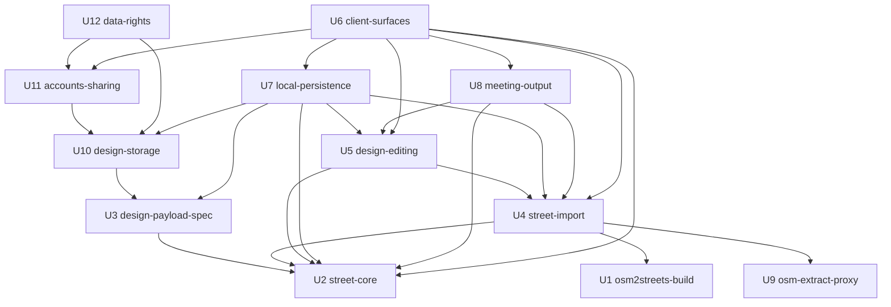

# Unit Dependency Graph — Streetmix at City Scale

Upstream inputs: `components.md` and `decisions.md` (domain-design),
`requirements.md` (requirements-analysis), `stories.md` (user-stories),
`unit-of-work.md` (this stage).

**This file is topology only.** It records what can depend on what. It does
not pick a build order and does not identify a critical path — those are
economic decisions made at Delivery Planning (2.9) using this graph as input.
Many orderings satisfy this graph; choosing among them is not a topological
question.

## How this graph was derived and checked

Every edge below is derived from a `depends_on` entry in `components.md`'s
YAML catalogue: Unit A depends on Unit B when a component in A depends on a
component in B. The result was then checked by parsing this file's own edge
block and re-running the acyclicity check against the parsed structure —
the same discipline `components.md` records for the component catalogue, and
for the same reason: the first arrangement this stage drew was acyclic in
prose and cyclic in fact.

## Edge block

```yaml
units:
  - name: osm2streets-build
    kind: packaging
    depends_on: []
  - name: street-core
    kind: library
    depends_on: []
  - name: osm-extract-proxy
    kind: service
    depends_on: []
  - name: design-payload-spec
    kind: spec
    depends_on: [street-core]
  - name: street-import
    kind: library
    depends_on: [street-core, osm2streets-build, osm-extract-proxy]
  - name: design-editing
    kind: library
    depends_on: [street-core, street-import]
  - name: design-storage
    kind: service
    depends_on: [design-payload-spec]
  - name: accounts-sharing
    kind: service
    depends_on: [design-storage]
  - name: data-rights
    kind: service
    depends_on: [design-storage, accounts-sharing]
  - name: local-persistence
    kind: ui
    depends_on: [street-core, street-import, design-editing, design-payload-spec, design-storage]
  - name: meeting-output
    kind: ui
    depends_on: [street-core, street-import, design-editing]
  - name: client-surfaces
    kind: ui
    depends_on: [street-core, street-import, design-editing, local-persistence, meeting-output, accounts-sharing]
```

Unit names map to the `U{n}` IDs and construction directories in
`unit-of-work.md` § "Unit index".

## Diagram



<!-- Text fallback: three Units have no dependencies — osm2streets-build,
street-core and osm-extract-proxy. design-payload-spec depends on street-core.
street-import depends on street-core, osm2streets-build and osm-extract-proxy.
design-editing depends on street-core and street-import. design-storage depends
on design-payload-spec; accounts-sharing on design-storage; data-rights on
design-storage and accounts-sharing. local-persistence depends on street-core,
street-import, design-editing, design-payload-spec and design-storage.
meeting-output depends on street-core, street-import and design-editing.
client-surfaces depends on street-core, street-import, design-editing,
local-persistence, meeting-output and accounts-sharing, and nothing depends on
client-surfaces. Edges point from a Unit to what it depends on. -->

Edges point from a Unit to what it depends on.

## Why the views are one Unit

The decomposition basis chosen at Q1 was feature slices — Units named for what
they deliver, cutting vertically through the layers. Drawn that way, the graph
was cyclic, and a cyclic edge block is not a preference to weigh but a failure:
this stage's `required-sections` check requires the block above to be
cycle-free.

The cause is structural. Three components read from **every** model layer while
no model layer reads back:

- `MapView` carries four simultaneous overlays — the network, the current
  design's streets, markers for unresolved corrections, and per-street fit
  status. So it depends on `CorridorPlanner` and `DesignOverlay` (editing) as
  well as `CorrectionOverlay` (import). Put `MapView` with the map-and-import
  feature and that feature now depends on editing; editing already depends on
  import through `CorrectionOverlay`, and the loop closes.
- `CrossSectionView` shows the baseline, the corrections and the proposed
  changes at once, so it reaches into import and editing both.
- `AppShell` depends on local persistence, upload, export, accounts and
  sharing — every one of which depends back on the editing model. Folding the
  shell into the editing Unit, as Q9 directed, closes a loop with each of them
  separately.

Views are sinks: they read every layer and nothing reads them. So the only
acyclic arrangements either place all three in one Unit, or split them into
several Units that are all sinks. Q11 chose the former, at 12 Units, over the
latter at 13.

The cost is recorded honestly in `unit-of-work.md`: `client-surfaces` is the
largest Unit in the set, carrying eleven stories and the whole accessibility
surface. The alternative was one more Unit's worth of gates, and
`team-practices.md` gates every Bolt through product Stage 1.

## Integration points between Units

| Boundary | Crosses | What crosses it | Mechanism |
|---|---|---|---|
| U4 `street-import` → U9 `osm-extract-proxy` | Browser to server | A request for an area; extract bytes back, or a typed failure | HTTP, synchronous |
| U7 `local-persistence` → U10 `design-storage` | Browser to server | A design payload on upload; a removal by anonymous identifier | HTTP, synchronous; shape owned by U3 |
| U6 `client-surfaces` → U11 `accounts-sharing` | Browser to server | Account creation, session establishment, grants and link state | HTTP, synchronous |
| U12 `data-rights` → U10, U11 | Inside one deployable | Erasure across designs, accounts, sessions, grants and links; export reads | In-process, synchronous |
| U4 `street-import` → U2 `street-core` | Inside the client workspace | The `StreetSource` port — the shape of "import a street", declared by the core and implemented by the adapter | Rust trait |
| U7, U10, U12 → U3 `design-payload-spec` | Both tiers and the database | The serialised design, its edits, its corrections and every provenance state | Shared schema |

**Contract Design (2.8) formalises the first three and the last.** The three
HTTP boundaries and the shared payload schema are the ones where two Units
must agree without sharing a compiler. The `StreetSource` port needs no
separate contract document: it is a Rust trait, and the compiler is the
contract.

## Parallel development opportunities

Sets of Units with no dependency between them. These are opportunities the
graph permits, not a schedule — Delivery Planning decides what is actually
worth doing at once, and `team-practices.md` sets Construction Autonomy Mode to
gate every Bolt through product Stage 1.

| Set | Units | Available once |
|---|---|---|
| The three roots | `osm2streets-build`, `street-core`, `osm-extract-proxy` | Immediately — none depends on anything |
| Spec and import | `design-payload-spec`, `street-import` | `street-core`, `osm2streets-build` and `osm-extract-proxy` are done |
| Editing and storage | `design-editing`, `design-storage` | `street-import` and `design-payload-spec` respectively are done |
| Output and accounts | `meeting-output`, `accounts-sharing` | `design-editing` and `design-storage` respectively are done |
| Persistence and rights | `local-persistence`, `data-rights` | `design-storage` plus their other inputs are done |

`client-surfaces` is reachable only after everything else it presents exists,
which is what being the graph's single sink means.

## Depth of the graph

The longest chain of dependencies is six Units:

```
street-core → design-payload-spec → design-storage → accounts-sharing
  → client-surfaces
```

and, on the client side, five:

```
osm2streets-build → street-import → design-editing → local-persistence
  → client-surfaces
```

This is stated as a property of the topology. It is **not** a critical path:
naming a critical path means asserting which chain governs delivery, and that
requires the economic judgement Delivery Planning applies. `stories.md`
already records a story-level critical path to a usable product Stage 1
(US2.1 → US2.2 → US3.1 → US5.1 → US8.1, with US4.1 for the provenance half),
and 2.9 reconciles the two.

## Verification

Checked against the parsed edge block above, not against the prose:

- Every Unit is named exactly once — 12 declarations, 12 distinct names.
- Every name in a `depends_on` list is a declared Unit.
- No Unit depends on itself.
- The graph is acyclic: a topological sort completes, consuming all 12 Units.
- Every `kind` is one of `service`, `spec`, `ui`, `packaging`, `library`.
- The Unit set matches `unit-of-work.md` § "Unit index" exactly — the same
  twelve names, no more and no fewer. This is asserted rather than assumed,
  because a partition checked against an open-ended bucket drifts silently.
